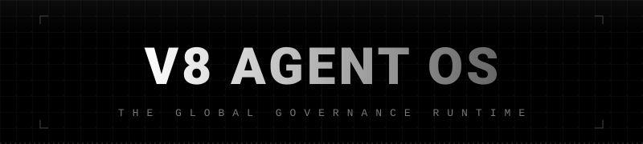

<div align="center">
  
</div>

<div align="center">
  <strong>A local-first Agent workspace for long-running tasks, project delivery, mobile collaboration, and creative media work.</strong>
</div>

<br>

<div align="center">

[中文](./README-ZH.md) · [Quick Start](./docs/V8_AGENT_OS_QUICK_START_ZH.md) · [Configuration](./docs/V8_AGENT_OS_CONFIG_GUIDE_ZH.md) · [Developer Guide](./docs/V8_AGENT_OS_DEVELOPER_GUIDE_ZH.md) · [Releases](https://github.com/justForever17/v8-agent-os/releases)

</div>

## What Is V8 Agent OS?

V8 Agent OS is a local-first Agent OS for people who want AI to work inside real projects, not just answer one-off prompts. It brings chat, workspaces, model management, long-term memory, task orchestration, mobile access, artifacts, and a desktop companion into one governable product.

At the center is the Supervisor: a user-facing coordinator that understands your goal, chooses whether to act directly or use a specialized mode, and checks the final result before handing it back to you.

## Who It Is For

- Builders who want an AI assistant to stay with a real project over time.
- Small teams that need research, coding, asset generation, documentation, and delivery proof in one place.
- Users who run the main system on a desktop but want a phone to monitor progress, answer questions, and send attachments.
- Power users who care about model routing, memory, tool boundaries, artifacts, and recoverable execution.

## Core Experience

### Desktop App

The desktop app is the main product line. It brings the chat surface, control center, engine, and desktop companion into a local shell so users do not need to remember service ports or keep several terminals open.

### Phone

Phone is the remote interaction surface. It is used to follow active sessions, answer blocking questions, send voice or files, inspect artifacts, and stay connected when you are away from the desktop.

### Supervisor

The Supervisor coordinates the work. It can handle simple tasks directly or route complex work into specialized modes such as coding, research, creative media, memory, or subagent collaboration.

### Specialized Modes

- Coding Mode: project creation, code changes, tests, and delivery proof.
- Research: source-backed search, evidence sorting, and research packs.
- Creative Media: images, video, audio, music, and 3D assets.
- Memory: preferences, knowledge, and long-running project context.
- Desktop Companion: follows the active session, plays actions and speech, and can send voice or snapshots as attachments.

### Plugin Manager

Plugin Manager installs reviewed CLI, MCP, Skill, and UI components from a signed catalog while keeping credentials behind opaque references. `@plugin` is a strong user hint, not the only entry: when a task clearly benefits from an installed, configured, healthy plugin, the Supervisor may create the smallest task-scoped grant and pass only a required component subset to a direct subagent. Installation, configuration, secret access, and lasting session grants remain user-controlled. The curated catalog includes official components such as GitHub, Figma, and the AMap CLI.

## Quick Start

### Download a Preview

Go to [GitHub Releases](https://github.com/justForever17/v8-agent-os/releases):

- Windows Desktop Preview: installer or zip package.
- Android Phone Preview: APK package.

The desktop build is currently an unsigned preview. Windows may show a security confirmation. Code signing and auto-update are planned for later releases.

### Run From Source

For developers and early testers:

```powershell
.\v8os.cmd preview --rebuild
```

This builds and starts the local desktop preview shell. You should see a V8OS desktop window rather than a set of development server pages.

### Connect Phone

Phone is paired through the desktop control center. Once paired, it keeps a local server profile and can reconnect without asking you to scan again after a temporary network failure.

## Current Status

| Product | Status | Notes |
| --- | --- | --- |
| Desktop | Preview | Windows unsigned preview is being finalized. Signing, auto-update, and stable releases are still future work. |
| Phone | Preview | Android APK first. iOS targets 16.4 and later, with the release pipeline still evolving. |
| TUI | Not implemented | Planned for terminal and server-first usage without the Admin UI. |
| Lite Binary | Long-term plan | A trimmed profile for low-power or edge devices. |

## Safety and Boundaries

V8OS is local-first by default. Desktop Web, Admin, Shell, and the companion are trusted local clients. Phone is the remote client and uses pairing. Multi-device collaboration, third-party plugin authorization, and network connections are advanced surfaces and are kept separate from ordinary local use.

User-facing surfaces should stay clean: status, results, risks, next steps, and artifacts. Internal scheduling data, raw model responses, audit records, and recovery metadata stay in diagnostics.

## Documentation

- [Quick Start](./docs/V8_AGENT_OS_QUICK_START_ZH.md)
- [Configuration Guide](./docs/V8_AGENT_OS_CONFIG_GUIDE_ZH.md)
- [Developer Guide](./docs/V8_AGENT_OS_DEVELOPER_GUIDE_ZH.md)
- [API Reference](./docs/V8_AGENT_OS_API_REFERENCE_ZH.md)
- [Productization Masterplan](./docs/V8OS/V8OS_PRODUCTIZATION_MASTERPLAN_ZH.md)
- [Release Versioning Baseline](./docs/V8OS/V8OS_RELEASE_VERSIONING_BASELINE_ZH.md)

## Feedback

V8OS is still moving quickly toward a more polished product. If you test the desktop preview or Phone build, please open a GitHub Issue with the version, platform, reproduction path, and screenshots or logs when possible.
