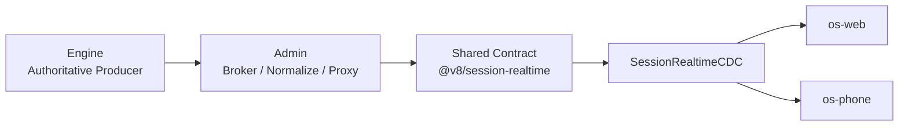
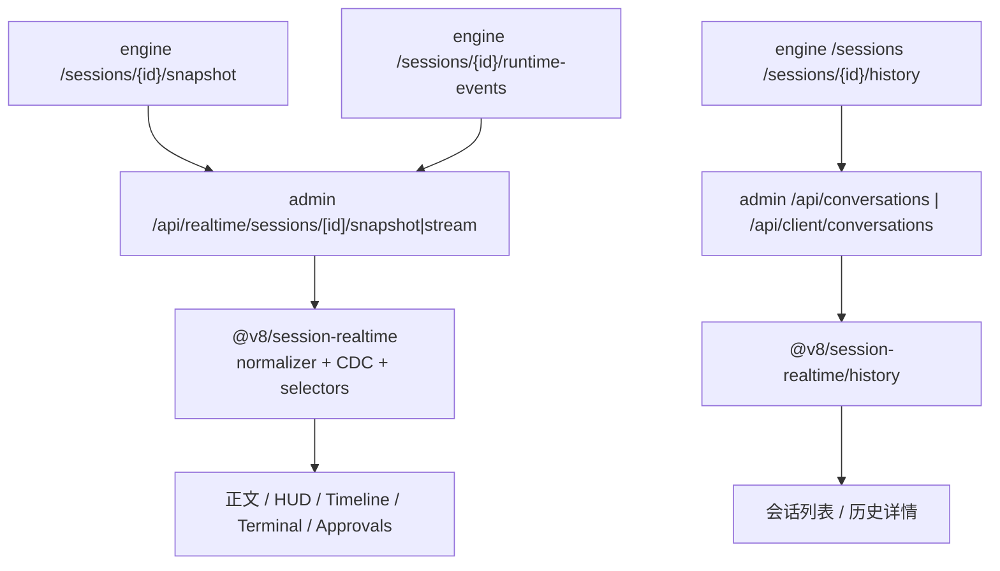

# V8 Agent OS 全局 API 与链路参考指南

适用范围：

- `E:\Projects\v8chat\v8-agent-os`
- `E:\Projects\v8chat\v8-agent-os-site`
- `E:\Projects\v8chat\v8-bridge`

读者：

- 新入职开发者
- 需要在 `engine / admin / os-web / os-phone` 之间增删改查的人
- 需要定位 realtime、history、approval、artifact、process、scope 问题的人

本文不是旧式“接口路径速查表”，而是回答下面这些问题：

1. 哪些接口是 `engine` 私有真相源，哪些接口是 `admin` 对外 broker
2. `web/phone` 应该调谁，绝不能直连谁
3. 哪些字段属于 realtime contract，哪些字段属于 history contract
4. 某个事件应该进正文、HUD、timeline 还是只进历史账本
5. 出现错误时应该沿哪条链排查

---

## 0. 先记住 6 条硬规则

1. `engine` 是实时态与历史态的唯一 authoritative producer。
2. `admin` 是唯一远端 broker，也是唯一允许 `web/phone` 依赖的后端入口。
3. `web/phone` 默认远端，不保证与 `engine` 同机，也不保证与 `admin` 同源。
4. 当前会话 realtime 只有 4 类 broker 事件：
   - `snapshot`
   - `runtime`
   - `heartbeat`
   - `error`
5. 当前会话主聊天组件禁止自行轮询 `/todos`、旧 detail、旧 projection 旁路接口。
6. 任何要给 surface 消费的资源或进程引用，都必须先经过 `admin` 规范化，不能把 `localhost`、本地路径或 engine 私网 URL 直接下发。

如果你先记不住全部内容，先记住这一句：

> 新增字段先落 `engine` 真相，再过 `admin` broker，再进 shared contract，再进 CDC selector，最后才轮到组件。

---

## 1. 总体拓扑



再展开一层：



这张图决定了 API 文档怎么读：

1. 先看 `engine` 真相源
2. 再看 `admin` broker
3. 再看 shared contract
4. 最后看 `web/phone` 是怎么消费

不要反过来从页面倒推真相。

---

## 2. Realtime contract：当前会话的唯一真相

### 2.1 authoritative snapshot

当前会话唯一 authoritative realtime payload 是：

- `GET /v1/sessions/{session_id}/snapshot`

它的字段至少固定包含：

1. `session`
2. `currentRun`
3. `latestSeq`
4. `messages`
5. `runtimeTimeline`
6. `approvals`
7. `controls`
8. `recoverable`
9. `artifacts`
10. `todos`
11. `workflowProjection`
12. `summary`
13. `processes`
14. `contextReferences`
15. `contextGovernance`

约束：

1. `todos` 必须是 **current active run scoped 的 active subset**
2. `processes` 必须是 **当前 active run 的交互式后台进程列表**
3. `contextReferences` 必须由 `engine` authoritative 产出，前端不再扫描 messages 反推
4. `contextGovernance` 必须由 `engine` authoritative 产出或 authoritative 吸收，前端不再本地猜

### 2.2 runtime side-channel

当前会话 side-channel 来源：

- `GET /v1/sessions/{session_id}/runtime-events?after_seq=...`

但这不是前端直接消费的协议。  
`admin` 会先把它规范化成 shared typed event，再通过 SSE 推给前端。

当前统一的前端 realtime 事件名只允许：

1. `snapshot`
2. `runtime`
3. `heartbeat`
4. `error`

`runtime` 的职责：

1. 提供即时反馈
2. 让正文在 snapshot 到来前先动起来
3. 更新 runtime timeline / governance HUD / ask-user / process 状态
4. 触发 `admin` 判断是否需要推送新的 authoritative snapshot

`runtime` 不是最终真相。  
最终真相永远是 `snapshot`。

### 2.3 哪些事件进正文，哪些只进 HUD

当前统一规则：

#### 进入 message + timeline + 相关 HUD

1. `agent_start`
2. `text_chunk`
3. `reasoning_chunk`
4. `tool_start`
5. `tool_result`
6. `artifact_recorded`
7. `ask_user`
8. 模型在工具前后给出的短说明消息

#### 默认进入 runtime HUD / timeline，只有自带可读文本时才进 narrative

1. `approval.approved`
2. `approval.rejected`
3. `approval.auto_approved`
4. `run.state.changed`
5. `run.paused`
6. `run.resumed`
7. `run.interrupted`
8. `run.cancelled`
9. `run.retry.requested`
10. `run.lane.released`
11. `run.lane.rejected`
12. `safety.preflight.blocked`

#### 进入 CDC store 与治理摘要，不进 narrative

1. `contextGovernance.changed`
2. 其他纯治理型、无可读正文必要的内部事件

### 2.4 终端/后台进程链的特殊规则

交互式终端属于当前会话 realtime 层，不属于 `desktop_live`。

统一规则：

1. 进程元数据走 `snapshot.processes`
2. 终端原始 `stdout/stderr` 不进入 assistant narrative 正文
3. 终端原始输出只进入 `InteractiveTerminalCard` / `ProcessesHUD`
4. 终止按钮、输入框、状态灯都必须基于 `AdminProcessRef`
5. 不允许再从 `tool_result` 文本里反推 `commandId`

---

## 3. History contract：历史层的唯一真相

历史层固定为两层：

1. **事件账本**
2. **物化汇总**

### 3.1 物化汇总

当前至少包含：

1. `sessionId`
2. `sourceGroup`
3. `runtimeOwner`
4. `startedAt`
5. `lastActivityAt`
6. `endedAt`
7. `status`
8. `currentRunId`
9. `lastRunId`
10. `title`
11. `previewExcerpt`
12. `lastNarrativeExcerpt`
13. `lastRuntimeSummary`
14. `pendingApprovalCount`
15. `recoverable`
16. `scopeTags`
17. `workflowSummary`
18. `metadata`

### 3.2 事件账本

账本条目至少包含：

1. `eventId`
2. `seq`
3. `sessionId`
4. `runId`
5. `ts`
6. `runtimeFamily`
7. `eventName`
8. `scope`
9. `visibility`
10. `targets`
11. `messageRef`
12. `toolCallId`
13. `processRef`
14. `resourceRef`
15. `payload`

### 3.3 时间规则

时间真相只允许来自 `engine`：

1. 统一 UTC ISO 时间戳
2. 统一单调 `seq`
3. `admin/web/phone` 禁止自己补造“历史时间”

如果你看到某处前端在本地拼 `lastActivityAt / previewExcerpt / workflowStatus`，那就是坏味道。

### 3.4 channels 的位置

`plugin_host_channel / channels` 只属于历史层，不进入当前会话 realtime CDC。

原因：

1. 第三方渠道异构
2. 高级交互组件不完整
3. 不适合强行塞进主聊天 message/HUD 语义

但 channels 历史记录仍然必须统一顶层 schema，并允许 source-specific 子文档：

1. `channelType`
2. `channelName`
3. `channelDomain`
4. `accountId`
5. `chatType`
6. 外部消息标识 / 投递状态 / 渠道特化状态

---

## 3.5 Path Govern API 规则

除了 realtime/history contract，本轮还固定了一层 `Path Govern` 规则。  
它不是单独的新接口，而是所有 workspace / artifact / resource API 的共同前提。

### 3.5.1 workspace 解析优先级

入口侧仍可接收：

1. `projectId`
2. `workspaceId`
3. `workspacePath`

但进入 engine 主链后，必须立即规范化成统一的 resolved workspace descriptor，至少包含：

1. `projectId`
2. `workspaceId`
3. `workspaceRoot`
4. `source`
5. `isScopedOverride`
6. `pathStatus`

解析优先级固定为：

1. 显式 `workspace_id/workspace_path`
2. active `session_scope_binding`
3. project 绑定的 workspace 根
4. main workspace

### 3.5.2 用户可见文件的 canonical 落点

1. 下载类媒体：
   - `<resolved_workspace_root>/downloaded_media/...`
2. 其他用户可见 artifact：
   - `<resolved_workspace_root>/.v8-agent-os/artifacts/<session>/<run>/<artifact>/...`

### 3.5.3 runtime 私有状态的 canonical 落点

runtime 私有状态统一进入：

- `~/.v8-agent-os/runtime-data/<runtime>/...`

例如：

1. `computer_use` trace / report
2. `rpa` drafts / scripts / templates / trust metrics
3. `plugin_host` 内部媒体槽位 / tts / attachment staging

### 3.5.4 surface resource contract 最小字段

任何要给 `web/phone` 消费的文件/媒体/附件，都必须转成 canonical artifact/resource contract。  
最小字段固定为：

1. `projectId`
2. `workspaceId`
3. `workspaceRoot`
4. `workspaceRelativePath`
5. `surfaceVisible`
6. `pathPlane`
7. `resourceRef`
8. `signedUrl`

其中 `pathPlane` 固定枚举为：

1. `runtime_private`
2. `workspace_download`
3. `workspace_artifact`

### 3.5.5 禁止项

以下内容不再允许直接作为 surface 可消费真相出现：

1. Windows 绝对路径
2. `~/.v8-agent-os/...`
3. runtime 私有目录路径
4. 旧 `.v8-agent-os-artifacts/...`
5. 未规范化的 `/workspace/...` 裸地址

如果路径命中 legacy residue 或受保护目录：

1. engine 直接发治理事件和推荐 canonical path
2. 不再让 supervisor 自己执行 shell 去“修路径”
3. Safety Guardian 不放宽

---

## 4. 谁该调谁：调用边界总表

### 4.1 `engine` 私有真相源

这些接口是 authoritative source，但**不是** `web/phone` 的直接依赖目标：

1. `/v1/sessions`
2. `/v1/sessions/{id}/snapshot`
3. `/v1/sessions/{id}/runtime-events`
4. `/v1/sessions/{id}/history`
5. `/v1/runs`
6. `/v1/approvals`
7. `/v1/bg_processes/*`
8. `/v1/artifacts/*`
9. `/v1/config-registry/*`

### 4.2 `admin` 公开 broker

`web/phone` 应该依赖的是 `admin` 暴露的代理与规范化接口：

1. `/api/realtime/sessions/[id]/snapshot`
2. `/api/realtime/sessions/[id]/stream`
3. `/api/conversations`
4. `/api/conversations/[id]`
5. `/api/client/conversations`
6. `/api/client/conversations/[id]`
7. `/api/client/realtime/sessions/[id]/snapshot`
8. `/api/client/realtime/sessions/[id]/stream`
9. `/api/approvals/*`
10. `/api/runs/*`
11. `/api/client/bg_processes/*`
12. 各类 admin 资源代理接口

### 4.3 `web/phone` 组件消费边界

组件不应该直接碰接口，而是应该碰：

1. `SessionRealtimeCDC`
2. shared selectors
3. shared history normalizer
4. `AdminResourceRef`
5. `AdminProcessRef`

如果某个聊天组件还在自己 `fetch("/todos")` 或扫描 message 文本反推状态，它就在破坏主链。

---

## 5. Engine 路由分组地图

下面不是逐条复述所有参数，而是告诉你：  
**哪一组接口属于哪条链、源码在哪、应该被谁调用。**

### 5.1 会话 / realtime / history / workflow

源码：

- `apps/v8-agent-os-engine/api/session_workflow_routes.py`

主要接口：

1. `GET /v1/sessions`
2. `POST /v1/sessions`
3. `DELETE /v1/sessions/{session_id}`
4. `GET /v1/sessions/{session_id}/messages`
5. `GET /v1/sessions/{session_id}/runtime-events`
6. `GET /v1/sessions/{session_id}/artifacts`
7. `GET /v1/sessions/{session_id}/snapshot`
8. `GET /v1/sessions/{session_id}/history`
9. `GET /v1/sessions/{session_id}/workflow`
10. `GET /v1/runs/{run_id}/workflow`
11. `GET /v1/workflows/{workflow_id}`
12. scope 相关接口：
   - `GET /v1/sessions/{session_id}/scope`
   - `PUT /v1/sessions/{session_id}/scope`
   - `POST /v1/sessions/{session_id}/scope/re-resolve`
   - `GET /v1/sessions/{session_id}/scope/history`
   - `POST /v1/scope/resolve`

职责：

1. 会话创建与删除
2. 当前会话 authoritative snapshot
3. 当前会话 runtime event ledger
4. 当前会话 history ledger / materialized record
5. workflow / runtime stability / scope resolution

谁应该调用：

1. `admin` 直接调
2. `web/phone` 通过 `admin` 间接调

### 5.2 流式聊天与长任务入口

源码：

- `apps/v8-agent-os-engine/api/chat_realtime_routes.py`

主要接口：

1. `POST /v1/chat/stream`
2. `WS /v1/chat/ws`

职责：

1. 发起 supervisor 主聊天
2. 产出本地发送流
3. 触发 run lifecycle 与 runtime events

注意：

1. 这不是 surface 持续订阅当前会话状态的主链
2. 当前会话的最终真相仍然要回到 `/snapshot` 与 `/runtime-events`

### 5.3 审批与 run control

源码：

- `apps/v8-agent-os-engine/api/run_control_routes.py`

主要接口：

1. `GET /v1/approvals`
2. `GET /v1/runs`
3. `POST /v1/runs/{run_id}/commands/{command}`
4. `POST /v1/approvals/{approval_id}/approve`
5. `POST /v1/approvals/{approval_id}/reject`

职责：

1. 人类确认
2. resume / interrupt / retry / cancel 一类 run control
3. 当前等待审批的控制面列表

### 5.4 交互式终端与后台进程

源码：

- `apps/v8-agent-os-engine/api/ops_routes.py`

主要接口：

1. `GET /v1/bg_processes/{cmd_id}`
2. `POST /v1/bg_processes/{cmd_id}/input`
3. `POST /v1/bg_processes/{cmd_id}/terminate`
4. `WS /v1/bg_processes/{cmd_id}/ws`

职责：

1. 进程状态查询
2. 终端输入
3. 终止进程
4. 原始终端输出流

注意：

1. 进程元数据真相来自 snapshot 的 `processes`
2. 这里的 WS 只负责进程输出 side-channel，不负责“发现进程”

### 5.5 配置主链

源码：

- `apps/v8-agent-os-engine/api/config_registry_routes.py`

主要接口：

1. `GET /v1/config-registry`
2. `GET /v1/config-registry/{domain}`
3. `POST /v1/config-registry/{domain}`

职责：

1. `config.json` 配置域级别读写
2. alias / compatibility shim 收口
3. workspace / supervisor / models / music 等配置域真相

不要绕过这条链去直接改零散旧 JSON。

### 5.6 computer_use / rpa / network_supervisor / desktop_live

源码：

1. `api/computer_use_routes.py`
2. `api/rpa_routes.py`
3. `api/network_supervisor_routes.py`
4. `api/desktop_live_routes.py`

说明：

1. `computer_use` 与 `rpa` 属于当前 runtime 主线
2. `network_supervisor` 属于主线，但更多是独立 runtime 面
3. `desktop_live` 当前明确排除在主聊天 realtime CDC 之外

不要把 `desktop_live` 的事件或状态卡混回主聊天 HUD。

### 5.7 knowledge / platform / extensions

源码：

1. `api/knowledge_routes.py`
2. `api/platform_routes.py`
3. `api/extensions_routes.py`

这些不是当前会话 realtime 主链，但属于配置、知识、平台控制面，文档里仍应视作 engine 对外能力的一部分。

---

## 6. Admin broker 路由地图

### 6.1 当前会话 realtime broker

源码：

- `apps/v8-agent-os-admin/src/app/api/realtime/sessions/[id]/stream/route.ts`
- `apps/v8-agent-os-admin/src/app/api/realtime/sessions/[id]/snapshot/route.ts`

职责：

1. 向 `engine` 拉 `/sessions/{id}/snapshot`
2. 向 `engine` 拉 `/sessions/{id}/runtime-events`
3. 用 shared normalizer 规范化 runtime event
4. 决定是否触发新的 authoritative snapshot push
5. 向 surface 只输出 `snapshot/runtime/heartbeat/error`

这是当前真正的 **snapshot-first broker**。

### 6.2 会话列表与会话详情 broker

源码：

- `apps/v8-agent-os-admin/src/app/api/conversations/route.ts`
- `apps/v8-agent-os-admin/src/app/api/conversations/[id]/route.ts`
- `apps/v8-agent-os-admin/src/app/api/client/conversations/route.ts`
- `apps/v8-agent-os-admin/src/app/api/client/conversations/[id]/route.ts`

职责：

1. 把 engine `/sessions` 规范化成 shared history record
2. 给 web 提供 `/api/conversations`
3. 给 phone 提供 `/api/client/conversations`

区别：

1. 路由形式不同
2. contract 相同
3. 最终都应该落到 shared history normalizer

### 6.3 审批 / runs / bg_processes broker

典型路径：

1. `/api/approvals`
2. `/api/approvals/[id]/approve`
3. `/api/approvals/[id]/reject`
4. `/api/runs`
5. `/api/runs/[runId]/commands/[command]`
6. `/api/client/bg_processes/*`

注意：

1. `AdminProcessRef` 下发的是 admin 可消费路径
2. admin 通过 rewrite/proxy 把 `/api/client/bg_processes/*` 转到 engine `/v1/bg_processes/*`
3. `web` 如果需要同类能力，走自己的 `/api/bg_processes/*` 代理

### 6.4 资源规范化

源码：

- `apps/v8-agent-os-admin/src/lib/server/session-realtime-resource.ts`

职责：

1. 把 artifact/workspace/media/control/process 引用转成 `AdminResourceRef` / `AdminProcessRef`
2. 去掉 engine 私网 URL
3. 去掉 `localhost`
4. 去掉本地路径

这是远端优先设计里非常关键的一层。

---

## 7. Web 与 Phone 的正确消费方式

### 7.1 web

典型入口：

1. `/api/conversations`
2. `/api/conversations/[id]`
3. `/api/realtime/sessions/[id]/snapshot`
4. `/api/realtime/sessions/[id]/stream`

消费特点：

1. 通过 web 自己的 `/api/*` 再转到 admin
2. 组件应该只消费 CDC selector
3. 不再自己解释 projection

### 7.2 phone

典型入口：

1. `/api/client/conversations`
2. `/api/client/conversations/[id]`
3. `/api/client/realtime/sessions/[id]/snapshot`
4. `/api/client/realtime/sessions/[id]/stream`

消费特点：

1. 通过 `adminBaseUrl + /api/client/*`
2. 同样只消费 shared contract
3. 不允许再保留“phone 私有实时语义”

### 7.3 不允许的做法

1. `web/phone` 直连 engine
2. `web/phone` 假设 `localhost:9530` 可访问
3. 组件自己轮询 `/todos`
4. 组件自己解释 runtime topic
5. 组件自己扫描 message 内容反推 process/todo/context refs

---

## 8. 典型链路：从用户发消息到界面更新

### 8.1 创建会话

1. surface 调 `admin /api/conversations` 或 `admin /api/client/conversations`
2. `admin` 转 `engine /v1/sessions`
3. `engine` 创建 session，并返回 authoritative history record
4. `admin` 用 shared history normalizer 规范化
5. `web/phone` 更新会话列表

### 8.2 发消息

1. surface 发起聊天请求
2. `engine /chat/stream` 或 `engine /chat/ws` 开始执行
3. `engine` 产出 runtime events 与 snapshot
4. `admin` broker 规范化 side-channel 并推 `snapshot/runtime`
5. `SessionRealtimeCDC` 吸收
6. `ChatWindow / RuntimeTimeline / HUD / TerminalCard` 一起更新

### 8.3 出现 ask-user / approval

1. `engine` 产出 approval 相关事件与 snapshot 变化
2. `admin` 推新的 `runtime + snapshot`
3. CDC selector 派发到：
   - AskUser UI
   - Approval UI
   - governance / runtime HUD

### 8.4 出现 artifact

1. `engine` 记录 artifact
2. snapshot `artifacts` 更新
3. `admin` 规范化成 `AdminResourceRef`
4. `ArtifactsPanel` / 正文渲染通过 admin ref 展示

### 8.5 出现交互式终端进程

1. `engine` 把进程写入 snapshot `processes`
2. `admin` 规范化成 `AdminProcessRef`
3. CDC selector 派发给 `ProcessesHUD` 和内联终端卡
4. `InteractiveTerminalCard` 再用 `streamAdminPath` 建立专用 WS
5. terminate/input 都走 `terminateAdminPath` / `inputAdminPath`

---

## 9. 新人最常做的 8 类改动

### 9.1 新增一个 realtime 事件

顺序必须是：

1. engine 真实产出该事件
2. shared `event-taxonomy.ts` 注册
3. shared `event-normalizer.ts` 规范化
4. shared lifecycle reducer 或 selector 决定去 message / HUD / timeline
5. admin broker 原样转发 normalized event
6. web/phone 只接 selector，不写私有 topic 特判

### 9.2 新增一个 snapshot 字段

顺序必须是：

1. engine snapshot 产出
2. shared `AuthoritativeSessionSnapshot` 扩字段
3. shared `session-view/cdc/selectors` 吸收
4. admin broker 原样带出
5. web/phone 组件只接 selector

### 9.3 新增一个历史列表字段

顺序必须是：

1. engine `build_session_history_materialized_record(...)` 产出
2. shared history contract 扩字段
3. admin 会话列表 broker 原样传
4. web/phone 同构消费

### 9.4 新增一个治理事件

例如：

1. `approval.approved`
2. `safety.preflight.blocked`
3. `run.lane.released`

处理规则：

1. 进 timeline 与 governance HUD
2. 只有自带可读文本时才进 narrative
3. 必须补 shared taxonomy，不允许降级成普通 progress

### 9.5 修改交互式终端展板

你应该改：

1. snapshot 的 `processes`
2. `AdminProcessRef`
3. shared process selector
4. `ProcessesHUD`
5. `InteractiveTerminalCard`

你不应该改：

1. message 文本解析器
2. `tool_result` 里的字符串抽取逻辑

### 9.6 修改图片 / 文件 / 资源 URL

你应该改：

1. engine 资源元数据
2. admin `session-realtime-resource.ts`
3. shared `AdminResourceRef`
4. web/phone 的资源解析函数

你不应该改：

1. 在 message 里硬塞 `localhost`
2. 在 phone/web 本地猜本机路径

### 9.7 修改会话列表 / 历史详情

你应该改：

1. engine history ledger / materialized summary
2. shared history contract
3. admin `/api/conversations` broker

你不应该改：

1. `web/phone` 本地手工拼 preview / workflowStatus / sourceGroup

### 9.8 删除兼容壳

原则：

1. 旧 compat route 只要不再被 surface 使用，就直接删
2. 不保留双轨
3. 先断前端引用，再删 broker，再删 engine compat

---

## 10. 最常见的 10 个排障入口

### 10.1 页面没更新，但 engine 好像在跑

顺序：

1. engine `/runtime-events` 有没有增长
2. engine `/snapshot.latestSeq` 有没有跟上
3. admin SSE 有没有推 `runtime/snapshot`
4. shared lifecycle / refresh 判定有没有误判
5. CDC store 有没有吸收
6. 组件是否还在读旧 local state

### 10.2 `/snapshot` 疯狂刷屏

优先看：

1. `packages/session-realtime/src/message-lifecycle.ts`
2. admin realtime broker 的 snapshot debounce/coalescing
3. phone 的 fallback snapshot refresh
4. 是否有旧 bundle / 旧 tgz

### 10.3 某类事件在正文里没了

优先看：

1. engine 是否产生
2. taxonomy 是否收录
3. normalizer 是否识别
4. lifecycle reducer 是否吸收
5. 组件是否支持对应 node kind

### 10.4 web/phone 表现不一致

优先看：

1. 是否还残留端内私有 projection glue
2. shared tgz 版本是否一致
3. 某端是否还在走旧 route / 旧 fallback

### 10.5 approval 不显示或状态错乱

优先看：

1. engine approval 记录
2. runtime event 是否有 `approval.*`
3. snapshot `approvals` 是否更新
4. CDC selector 是否吸收

### 10.6 终端卡不出现 / 终止按钮失效

优先看：

1. snapshot `processes`
2. `AdminProcessRef`
3. admin rewrite / process path
4. `InteractiveTerminalCard` 是否拿到 ref
5. `streamAdminPath/inputAdminPath/terminateAdminPath` 是否有效

### 10.7 图片 / artifact 打不开

优先看：

1. payload 是否残留 `localhost` / 本地路径 / engine 私网 URL
2. admin 是否做了 resource normalize
3. web/phone 是否正确解析 `AdminResourceRef`

### 10.8 新建会话或历史列表 500

优先看：

1. `session_workflow_routes.py`
2. `session_history_contract.py`
3. `build_session_history_materialized_record(...)`
4. `build_session_history_detail(...)`
5. 是否空值安全

### 10.9 history 列表字段怪异

优先看：

1. engine materialized record
2. history normalizer
3. admin conversations broker
4. 前端是否还在本地 patch

### 10.10 远端 surface 表现异常

优先看：

1. admin base URL
2. broker 输出的 resource/process ref
3. web 自己的 `/api/*` 代理
4. phone 的 `adminBaseUrl`

---

## 11. 本地开发最小启动矩阵

### 11.1 engine

工作目录：

- `E:\Projects\v8chat\v8-agent-os\apps\v8-agent-os-engine`

常用：

```powershell
.\.venv\Scripts\python.exe .\main.py
```

### 11.2 admin

工作目录：

- `E:\Projects\v8chat\v8-agent-os\apps\v8-agent-os-admin`

常用：

```powershell
npm run dev
```

### 11.3 web

工作目录：

- `E:\Projects\v8chat\v8-agent-os\apps\v8-agent-os-web`

常用：

```powershell
npm run dev
```

### 11.4 phone

工作目录：

- `E:\Projects\v8chat\v8-agent-os\apps\v8-agent-os-phone`

常用：

```powershell
npm run start
npm run typecheck
npm run doctor
```

### 11.5 shared 包

工作目录：

- `E:\Projects\v8chat\v8-agent-os\packages\session-realtime`

常用：

```powershell
npm run build
npm pack
```

shared 包改完后，如果三端没重新装新 tarball，你看到的行为就可能全是旧逻辑。

---

## 12. 改完后最低验证要求

### 12.1 改 shared contract

至少做：

1. `packages/session-realtime`: `npm run build`
2. `packages/session-realtime`: `npm pack`
3. 重新安装到 `admin/web/phone`
4. `admin`: `npx tsc --noEmit`
5. `web`: `npx tsc --noEmit`
6. `phone`: `npm run typecheck`

### 12.2 改 engine realtime/history

至少做：

1. Python 级语法检查
2. 真实启动 engine
3. 跑一条真实 supervisor 长任务
4. 同时观察：
   - engine `/runtime-events`
   - engine `/snapshot`
   - admin SSE
   - web
   - phone

### 12.3 改 history

至少做：

1. 新建会话
2. 发起长任务
3. 结束后检查：
   - realtime 是否正常
   - history ledger 是否完整
   - materialized summary 是否正确
   - web/phone 会话列表是否同构

---

## 13. 这份文档怎么和其他文档配合

建议阅读顺序：

1. 先读 [ENGINE_DEVELOPER_GUIDE_ZH.md](./ENGINE_DEVELOPER_GUIDE_ZH.md)
2. 再读本文
3. 再读 [E:\Projects\v8chat\docs\Govern\GOVERN_ARCHITECTURE_UPGRADE_PLAN_2026-04-06.md](E:\Projects\v8chat\docs\Govern\GOVERN_ARCHITECTURE_UPGRADE_PLAN_2026-04-06.md)

分工：

1. 开发者指南：告诉你“该改哪里、该查哪里”
2. API 参考：告诉你“谁是 contract、谁该调用谁、字段和链路怎么走”
3. Govern 文档：告诉你“为什么现在要这么设计，以及下一阶段如何继续收口”

---

## 14. 最后一条纪律

如果你读完本文，只记住一条纪律，也请记住：

> 任何用户可见状态，必须能从 `engine 真相 -> admin broker -> shared contract -> CDC selector -> 组件` 这条链被完整解释。  
> 只要某个字段、某个事件、某个 HUD 无法沿这条链解释，它就还没有真正进入主标准。
