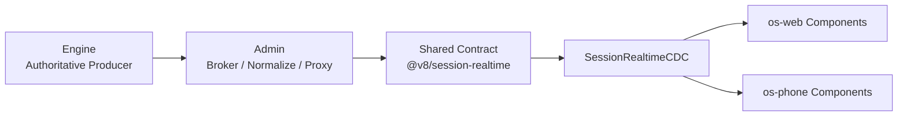

# V8 Agent OS 全局开发者指南

适用范围：

- `E:\Projects\v8chat\v8-agent-os`
- `E:\Projects\v8chat\v8-agent-os-site`
- `E:\Projects\v8chat\v8-bridge`

读者：

- 新入职开发者
- 需要在 Engine / Admin / Web / Phone / Bridge 之间增删改查的人
- 需要定位 realtime / history / runtime governance 故障的人

本文目标不是介绍几个接口名，而是让开发者读完之后能明确回答下面这些问题：

1. 现在系统的唯一真相链是什么
2. 某个字段、某个事件、某个 HUD 应该改哪里
3. 新增能力时应该沿哪条主链落地
4. 出现问题时应该沿哪条链排查
5. 哪些边界已经锁死，不能再被兼容壳带偏

---

## 1. 一句话总纲

> V8 Agent OS 当前不是“聊天产品继续堆功能”的阶段，而是把系统收成一台统一、可恢复、可观测、远端优先的 runtime 机器。

这意味着：

1. `engine` 是唯一 authoritative producer
2. `admin` 是唯一远端 broker
3. `os-web` 与 `os-phone` 是同一 surface 的两个壳
4. 所有主聊天组件只能消费统一 contract
5. 历史兼容壳不是长期资产，只是待删除负债

如果某个改动让系统又回到“每端各猜一套状态”，那它就是坏改动。

---

## 2. 新人先建立的心智模型

### 2.1 全局主链



这条链已经不是建议，而是当前主线标准。

你看到的任何用户可见状态，理论上都应该能沿这条链追溯：

1. `engine` 产生了什么
2. `admin` 转发了什么
3. shared contract 把它解释成了什么
4. CDC store 里存了什么
5. 组件最终展示了什么

### 2.2 两类平面

系统现在可以粗分成两大平面：

1. **实时交互层**
   - 当前会话
   - 当前 active run
   - 正文、思考、工具调用、审批、artifact、todos、runtime HUD、终端进程卡
2. **历史归档层**
   - 会话列表
   - 历史详情
   - 事件账本
   - 物化摘要
   - channels 特化存储

不要混用。

实时层的问题，不要先去翻历史列表逻辑。  
历史层的问题，也不要先去修聊天窗口 reducer。

---

## 3. 当前锁死的边界

下面这些边界已经定了，开发时不要再打破。

### 3.1 纳入实时主链的 runtime family

以下 family 属于当前会话实时交互层：

1. `chat`
2. `automation`
3. `extensions`
4. `network_supervisor`
5. `computer_use`
6. `rpa`
7. `plugin_host_tool`

### 3.2 明确排除的 family

以下 family 不进入当前会话 realtime CDC：

1. `memory`
   - 底层保障 runtime
   - 不参与前端实时互动
2. `desktop_live`
   - 手工驱动通讯
   - 本轮不纳入统一 realtime 主链
3. `plugin_host_channel`
   - OpenClaw `channels` 型外部通讯
   - 归历史层，不进入主聊天实时 CDC

### 3.3 远端约束

`web` 和 `phone` 默认是远端 surface，不保证：

1. 与 `engine` 同机
2. 与 `admin` 同源
3. 能访问 engine 私网端口
4. 能访问本地路径
5. 能消费 `localhost` URL

因此，所有可视资源都必须经过 `admin` 规范化成 surface 可消费引用。

---

## 4. 三仓职责地图

### 4.1 `v8-agent-os`

主产品仓，负责运行时与控制面的主链。

#### Engine

目录重点：

- `apps/v8-agent-os-engine/api`
- `apps/v8-agent-os-engine/erc`
- `apps/v8-agent-os-engine/core`
- `apps/v8-agent-os-engine/runtimes`
- `apps/v8-agent-os-engine/agents`

职责：

1. 产生 realtime snapshot
2. 产生 runtime events
3. 产生 history ledger / materialized summary
4. 持有 run lifecycle 真相
5. 持有 approvals / recoverable / workflow ledger 真相

#### Admin

目录重点：

- `apps/v8-agent-os-admin/src/app/api`
- `apps/v8-agent-os-admin/src/lib/server`

职责：

1. 对外提供唯一可信 broker
2. 规范化 realtime event / snapshot
3. 代理 engine 资源
4. 把私有 URL / 私有路径改写成 surface 可消费 ref

#### Web

目录重点：

- `apps/v8-agent-os-web/src/app`
- `apps/v8-agent-os-web/src/components/chat`
- `apps/v8-agent-os-web/src/lib`

职责：

1. 消费 shared realtime/history contract
2. 通过 CDC selector 渲染组件
3. 不再本地发明 projection 语义

#### Phone

目录重点：

- `apps/v8-agent-os-phone/src/screens`
- `apps/v8-agent-os-phone/src/components/chat`
- `apps/v8-agent-os-phone/src/lib`

职责：

1. 与 `web` 平行消费同一 contract
2. 重点承接远端与移动端交互差异
3. 不允许继续保留“私有消息链”

### 4.2 `v8-agent-os-site`

公开叙事仓。

职责：

1. 公开说明
2. 安装入口
3. 文档聚合

不负责：

1. 发明新的 runtime 语义
2. 替代主仓提供事实源

### 4.3 `v8-bridge`

OpenClaw 生态桥接仓。

职责：

1. `plugin_host` / OpenClaw bridge 的核心逻辑
2. tool / channel handoff
3. fail-closed 与桥接安全

如果改动会影响 `plugin_host`、OpenClaw channels、managed channels 或 handoff token，就必须把它当 runtime 主链的一部分处理。

---

## 5. 真相源优先级

出现“代码、页面、文案、历史注释都不一致”时，按这个顺序裁决：

1. `v8-agent-os` 当前主链代码
2. 当前主线文档
3. 同级生态仓事实
4. 历史文档、兼容壳、旧注释

具体到本轮统一化之后：

1. realtime 真相：`engine /sessions/{id}/snapshot`
2. runtime side-channel 真相：normalized `runtime` event
3. history 真相：engine 产生的 ledger + materialized summary
4. surface 真相：`SessionRealtimeCDC` 与 shared selector

页面不是事实源。  
临时 reducer 不是事实源。  
旧 detail 接口不是事实源。

---

## 6. 当前最重要的共享合同

shared 包位置：

- `packages/session-realtime`

这是当前 realtime/history 统一化的核心。

---

## 6.5 Path Govern Plane：文件到底该落哪里

这轮之后，本地路径不能再按“谁顺手就往哪写”理解，而必须按 `Path Govern Plane` 理解。

### 6.5.1 四层路径模型

1. `Runtime Home Plane`
   - 根固定为 `~/.v8-agent-os`
   - 只承载：
     - `config.json`
     - `V8_AGENT_OS.md`
     - `state.db`
     - `checkpoints.db`
     - secrets / cache / logs
     - runtime 私有状态根
2. `Workspace Resolution Plane`
   - 解析优先级固定为：
     1. 显式 `workspace_id/workspace_path`
     2. active `session_scope_binding`
     3. `project` 绑定的 workspace 根
     4. main workspace
3. `Workspace Output Plane`
   - 下载类媒体：
     - `<resolved_workspace_root>/downloaded_media/...`
   - 其他用户可见 artifact：
     - `<resolved_workspace_root>/.v8-agent-os/artifacts/<session>/<run>/<artifact>/...`
4. `Runtime Private State Plane`
   - 各 runtime 私有状态：
     - `~/.v8-agent-os/runtime-data/<runtime>/...`

### 6.5.2 哪些旧目录不再是主链

下面这些目录如果还存在，只是废弃残留：

1. `~/.v8-agent-os/computer_use_traces`
2. `~/.v8-agent-os/reports/computer_use`
3. `~/.v8-agent-os/rpa/*`
4. `main workspace/plugin_host`
5. `.v8-agent-os-artifacts`

默认规则是：

1. 不迁移
2. 不双读
3. 不兼容

### 6.5.3 各 runtime 的落盘纪律

1. `computer_use`
   - 截图/观察 artifact：workspace artifact plane
   - trace/report：`runtime-data/computer_use`
2. `rpa`
   - drafts/scripts/templates/trust metrics：`runtime-data/rpa`
   - 对外用户文件：workspace output plane
3. `plugin_host`
   - tts / inbound-outbound staging / 内部媒体槽位：`runtime-data/plugin_host`
   - 对外资源：canonical artifact/resource ref
4. 下载媒体
   - `download_media_for_vision` 直接落 `<workspace>/downloaded_media`

### 6.5.4 出路径问题时沿哪条链查

1. 先看 `core/workspace_resolution.py`
   - 当前 session 到底解析到了哪个 workspace
2. 再看 `core/workspace_guard.py`
   - 有没有命中 legacy residue / 受保护目录
3. 再看具体 runtime 的落盘点
   - 它写到的是 `runtime-data` 还是 workspace output
4. 最后看 `admin` / `web` / `phone`
   - 有没有继续展示裸路径，而不是 canonical artifact/resource ref

### 6.1 你必须熟悉的类型

#### 实时层

1. `AuthoritativeSessionSnapshot`
2. `NormalizedSessionRuntimeEvent`
3. `SessionRealtimeStore`
4. `SessionRealtimeCDC`
5. `RuntimeEventMatrixEntry`
6. `AdminResourceRef`
7. `AdminProcessRef`

#### 历史层

1. `AuthoritativeSessionHistoryRecord`
2. `SessionHistoryLedgerEntry`
3. `SessionHistoryMaterializedView`
4. `ChannelHistorySubdocument`

### 6.2 你必须熟悉的 shared 文件

1. `packages/session-realtime/src/contract.ts`
2. `packages/session-realtime/src/cdc.ts`
3. `packages/session-realtime/src/event-taxonomy.ts`
4. `packages/session-realtime/src/event-normalizer.ts`
5. `packages/session-realtime/src/message-lifecycle.ts`
6. `packages/session-realtime/src/resources.ts`
7. `packages/session-realtime/src/session-view.ts`
8. `packages/session-realtime/src/history.ts`

### 6.3 shared 包负责什么

它负责：

1. 定义 contract
2. 解释 runtime family
3. 标准化 event taxonomy
4. 规范化 runtime envelope
5. 统一 lifecycle reducer
6. 提供 CDC store 与 selector 语义
7. 统一资源与进程引用语义

它不负责：

1. 直接访问数据库
2. 发请求
3. 保存 UI 局部状态

---

## 7. 目录地图：遇到问题先看哪

### 7.1 当前会话实时问题

先看：

1. `apps/v8-agent-os-engine/erc/snapshot_service.py`
2. `apps/v8-agent-os-engine/erc/session_realtime_contract.py`
3. `apps/v8-agent-os-engine/core/runtime_projection.py`
4. `apps/v8-agent-os-admin/src/app/api/realtime/sessions/[id]/stream/route.ts`
5. `packages/session-realtime/src/*`
6. `apps/v8-agent-os-web/src/app/chat/ChatClient.tsx`
7. `apps/v8-agent-os-phone/src/screens/ChatScreen.tsx`

### 7.2 历史记录问题

先看：

1. `apps/v8-agent-os-engine/erc/session_history_contract.py`
2. `apps/v8-agent-os-engine/api/session_workflow_routes.py`
3. `apps/v8-agent-os-admin/src/app/api/conversations/route.ts`
4. `apps/v8-agent-os-admin/src/app/api/client/conversations/route.ts`
5. `apps/v8-agent-os-web/src/lib/session-history.ts`
6. `apps/v8-agent-os-phone/src/lib/session-history.ts`

### 7.3 终端/后台进程问题

先看：

1. `apps/v8-agent-os-engine/core/native_tools.py`
2. `apps/v8-agent-os-engine/erc/session_realtime_contract.py`
3. `apps/v8-agent-os-admin/src/lib/server/session-realtime-resource.ts`
4. `packages/session-realtime/src/resources.ts`
5. `packages/session-realtime/src/cdc.ts`
6. `apps/v8-agent-os-web/src/components/chat/InteractiveTerminalCard.tsx`
7. `apps/v8-agent-os-phone/src/components/chat/InteractiveTerminalCard.tsx`

### 7.4 审批 / Govern / run control 问题

先看：

1. `apps/v8-agent-os-engine/erc/command_router.py`
2. `apps/v8-agent-os-engine/erc/workflow_ledger.py`
3. `apps/v8-agent-os-engine/core/runtime_projection.py`
4. `packages/session-realtime/src/event-taxonomy.ts`
5. `packages/session-realtime/src/message-lifecycle.ts`
6. `RunControlBar`、approval UI 组件

### 7.5 资源 URL / 远端渲染问题

先看：

1. `apps/v8-agent-os-admin/src/lib/server/session-realtime-resource.ts`
2. `packages/session-realtime/src/resources.ts`
3. `apps/v8-agent-os-phone/src/lib/workspace-links.ts`
4. `apps/v8-agent-os-web` 与 `apps/v8-agent-os-phone` 的 artifact / markdown 组件

---

## 8. 新人第一周应该怎么上手

### 8.1 第一天先读什么

按这个顺序：

1. 本文
2. `docs/Govern/GOVERN_ARCHITECTURE_UPGRADE_PLAN_2026-04-06.md`
3. `packages/session-realtime/src/contract.ts`
4. `packages/session-realtime/src/cdc.ts`
5. `apps/v8-agent-os-engine/api/session_workflow_routes.py`
6. `apps/v8-agent-os-engine/erc/snapshot_service.py`
7. `apps/v8-agent-os-admin/src/app/api/realtime/sessions/[id]/stream/route.ts`
8. `apps/v8-agent-os-web/src/app/chat/ChatClient.tsx`
9. `apps/v8-agent-os-phone/src/screens/ChatScreen.tsx`

### 8.2 第一件建议做的小事

不要一上来改 runtime。

先做这类小任务：

1. 给 shared selector 增一个派生字段
2. 给 web/phone 同时补一个只读展示
3. 在 engine snapshot 中增加一个安全的非破坏字段

这样能快速熟悉主链，又不容易把 run lifecycle 搞坏。

---

## 9. 实时链怎么工作

### 9.1 State Plane

`engine /sessions/{id}/snapshot`

职责：

1. 当前会话 authoritative state
2. 包含 messages / timeline / approvals / controls / processes / todos / context refs 等

### 9.2 Event Plane

`engine /sessions/{id}/runtime-events`

职责：

1. side-channel
2. 低延迟事件
3. 不代替 authoritative snapshot

### 9.3 Broker Plane

`admin /api/realtime/sessions/[id]/stream`

职责：

1. 轮询或订阅 engine runtime 变化
2. 做规范化
3. 决定何时推送新的 snapshot
4. 向 frontends 只输出：
   - `snapshot`
   - `runtime`
   - `heartbeat`
   - `error`

### 9.4 Projection / Consumption Plane

`SessionRealtimeCDC + selectors`

职责：

1. 吸收 snapshot
2. 吸收 normalized runtime
3. 形成统一 store
4. 给组件派发一致 selector

### 9.5 组件消费纪律

所有主聊天组件必须：

1. 只从 CDC selector 取数
2. 不得自行轮询
3. 不得自行解释 topic
4. 不得扫描 message 文本反推 process/todo/context refs

---

## 10. 历史链怎么工作

### 10.1 两层结构

历史层固定为：

1. **事件账本**
2. **物化汇总**

### 10.2 engine 的职责

engine 必须独立产出：

1. `ledger`
2. `materialized record`
3. authoritative 时间戳

前端不得自己拼：

1. `previewExcerpt`
2. `sourceGroup`
3. `runtimeStatus`
4. `workflowStatus`
5. `lastActivityAt`

### 10.3 channels 的位置

`plugin_host_channel` 只进历史层。

原因：

1. 第三方渠道异构
2. 高级交互组件缺失
3. 不适合塞进主聊天 realtime CDC

但历史层仍然必须统一外壳：

1. 顶层 schema 一致
2. source-specific 子文档可变

---

## 11. 做增删改查时应该怎么落刀

### 11.1 新增一个 realtime 事件

标准步骤：

1. 在 engine 确认事件真的产生
2. 把它纳入 authoritative snapshot 或 side-channel 规则
3. 在 `packages/session-realtime/src/event-taxonomy.ts` 注册 taxonomy
4. 在 `event-normalizer.ts` 确保能转成 normalized typed event
5. 在 `message-lifecycle.ts` 或 selector 里决定它进 message、HUD 还是 timeline
6. 在 web/phone 组件中只接 selector，不写私有 topic 特判
7. 验证：
   - engine 事件存在
   - admin 转发存在
   - web/phone 都看到同一语义

### 11.2 新增一个 HUD 组件

标准步骤：

1. 先问自己：它属于 active run scoped 还是 session scoped
2. 在 shared selector 中增加派生数据
3. 组件只接 selector
4. 禁止组件自己发请求
5. 禁止组件解析 runtime topic

### 11.3 新增一个历史列表字段

标准步骤：

1. 在 engine materialized record 里产出
2. shared history contract 增字段
3. admin route 原样 broker
4. web/phone 同构消费

### 11.4 修改进程/终端展板

标准步骤：

1. 进程元数据必须来自 authoritative snapshot 的 `processes`
2. 进程输出走专用 WS side-channel
3. `ProcessesHUD` 与内联终端卡必须指向同一 `AdminProcessRef`
4. 不得继续从 message/tool_result 反推进程

---

## 12. 常见故障怎么排

这一节是最重要的。  
新人看到异常时，必须沿链排查，不允许先修表象。

### 12.1 页面没更新，但 engine 好像在跑

排查顺序：

1. `engine /runtime-events` 是否真的在增长
2. `engine /snapshot` 的 `latestSeq` 是否跟上
3. `admin` 是否在推 `snapshot` / `runtime`
4. shared `shouldAuthoritativelyRefreshOnRuntimeEvent()` 是否误判
5. CDC store 是否吸收了事件
6. 组件是否还在读旧 local state

### 12.2 snapshot 风暴 / 日志疯狂刷 `/snapshot`

优先看：

1. `packages/session-realtime/src/message-lifecycle.ts`
2. `admin` realtime broker 里的 snapshot queue / debounce
3. `phone` fallback snapshot refresh

常见根因：

1. 把几乎所有 runtime event 都判成“必须 authoritative refresh”
2. admin 与 phone 同时补拉 snapshot
3. 客户端 bundle 还在跑旧 shared tgz

### 12.3 某类事件在正文里消失了

先看：

1. engine 是否真的产生了事件
2. event taxonomy 是否收录
3. normalizer 是否把它降级成普通 progress
4. lifecycle reducer 是否把它吃进了 message
5. 组件是否只会渲染旧 node kind

### 12.4 同一会话 web 和 phone 表现不一致

先看：

1. shared selector 是否已经统一
2. 两端是否还残留私有 projection glue
3. 两端依赖的 tgz 是否是同一版本
4. 某端是否仍在用旧 route / 旧 fallback

### 12.5 新建会话 / 历史列表 500

先看：

1. `session_workflow_routes.py`
2. `session_history_contract.py`
3. `build_session_history_materialized_record(...)`
4. `workflow_view / session_row / approvals` 是否空值安全

### 12.6 终端展板不出现或终止按钮失效

先看：

1. `native_tools.py` 是否产生后台进程快照
2. snapshot 的 `processes` 是否存在
3. admin 是否把 process admin path 规范化
4. `ProcessesHUD` 和 `InteractiveTerminalCard` 是否都接到同一 `AdminProcessRef`

### 12.7 artifact / 图片 / 文件在远端 surface 打不开

先看：

1. payload 里是否还残留 `localhost` / 本地路径 / engine 私网 URL
2. `session-realtime-resource.ts` 是否已规范化
3. shared `AdminResourceRef` 是否正确解析
4. web 是否走自己的 `/api/*` 代理
5. phone 是否走 `adminBaseUrl`

---

## 13. 哪些事情明确不要做

1. 不要在 web/phone 本地重新发明 projection 逻辑
2. 不要让 HUD 自己去轮询 `/todos`、旧 detail、旧 projection
3. 不要把 `channels` 外部通讯又塞回 realtime CDC
4. 不要把 `desktop_live` 当成普通 runtime HUD 去混进主聊天面
5. 不要把 engine 私有路径或 `localhost` 直接下发给远端 surface
6. 不要把旧兼容壳继续当真相源

---

## 14. 最低验证要求

### 14.1 改 shared contract 后

至少要做：

1. `packages/session-realtime`: build
2. 重新 pack
3. admin/web/phone 重新安装 tgz
4. 三端类型检查

### 14.2 改 engine realtime/history 后

至少要做：

1. Python 级语法检查
2. 真实启动 engine
3. 真实打一条 supervisor 长任务
4. 同时看：
   - engine 日志
   - admin broker
   - web
   - phone

### 14.3 改文档后

要问自己：

1. 新人是否能用它判断“应该改哪里”
2. 新人是否能用它判断“应该先查哪条链”
3. 它是否在描述旧兼容壳，而不是当前主链

---

## 15. 新人遇错时的最短口诀

如果你只记住一句排障口诀，请记住：

> 先看 engine 有没有产出，再看 admin 有没有规范化，再看 shared contract 有没有吸收，最后才看 web/phone 组件有没有消费。

沿着这条链查，问题通常不会跑偏。

---

## 16. 本地启动矩阵与最小工作流

如果你是新入职开发者，这一节必须能直接照着做。

### 16.1 先启动哪些服务

推荐顺序：

1. `engine`
2. `admin`
3. `web`
4. `phone`

原因：

1. `engine` 是唯一真相生产者
2. `admin` 是唯一 broker
3. `web/phone` 都只是 surface

### 16.2 各仓最小启动命令

#### Engine

目录：

- `E:\Projects\v8chat\v8-agent-os\apps\v8-agent-os-engine`

命令：

```powershell
.\.venv\Scripts\python.exe .\main.py
```

#### Admin

目录：

- `E:\Projects\v8chat\v8-agent-os\apps\v8-agent-os-admin`

命令：

```powershell
npm run dev
```

#### Web

目录：

- `E:\Projects\v8chat\v8-agent-os\apps\v8-agent-os-web`

命令：

```powershell
npm run dev
```

#### Phone

目录：

- `E:\Projects\v8chat\v8-agent-os\apps\v8-agent-os-phone`

命令：

```powershell
npm run start
npm run typecheck
npm run doctor
```

#### Shared Contract

目录：

- `E:\Projects\v8chat\v8-agent-os\packages\session-realtime`

命令：

```powershell
npm run build
npm pack
```

### 16.3 新人第一天最值得做的 3 件小事

1. 跑通一条真实 supervisor 长任务，同时盯着：
   - engine `/runtime-events`
   - engine `/snapshot`
   - admin realtime stream
   - web
   - phone
2. 修改 shared contract 里一个无风险显示字段，然后重新 pack 给三端，感受一次完整链路。
3. 新增一个只进 timeline 的 governance 事件，验证自己已经理解“message / HUD / timeline / history”四个落点的区别。

### 16.4 改动前的自检问题

动手前先问自己：

1. 这次改的是 realtime 还是 history？
2. 真相源应该在 engine 还是已经是 admin/shared 层？
3. 这个字段是 active run scoped 还是 session scoped？
4. 它是 narrative、HUD、timeline、history 哪一种可见性？
5. 这次改动会不会让 web/phone 再次分叉？

---

## 17. 按需求类型找文件

这节的目标是：  
你接到一个需求后，不用先在整个仓库里瞎搜半天。

### 17.1 改当前会话正文、思考、工具调用、短说明消息

先看：

1. `E:\Projects\v8chat\v8-agent-os\apps\v8-agent-os-engine\api\chat_realtime_routes.py`
2. `E:\Projects\v8chat\v8-agent-os\packages\session-realtime\src\event-taxonomy.ts`
3. `E:\Projects\v8chat\v8-agent-os\packages\session-realtime\src\event-normalizer.ts`
4. `E:\Projects\v8chat\v8-agent-os\packages\session-realtime\src\message-lifecycle.ts`
5. `E:\Projects\v8chat\v8-agent-os\apps\v8-agent-os-web\src\hooks\use-langgraph-stream.ts`
6. `E:\Projects\v8chat\v8-agent-os\apps\v8-agent-os-phone\src\screens\ChatScreen.tsx`

### 17.2 改 snapshot 字段、workflowProjection、summary、controls

先看：

1. `E:\Projects\v8chat\v8-agent-os\apps\v8-agent-os-engine\erc\snapshot_service.py`
2. `E:\Projects\v8chat\v8-agent-os\apps\v8-agent-os-engine\erc\session_realtime_contract.py`
3. `E:\Projects\v8chat\v8-agent-os\apps\v8-agent-os-engine\core\runtime_projection.py`
4. `E:\Projects\v8chat\v8-agent-os\packages\session-realtime\src\contract.ts`
5. `E:\Projects\v8chat\v8-agent-os\packages\session-realtime\src\cdc.ts`
6. `E:\Projects\v8chat\v8-agent-os\packages\session-realtime\src\session-view.ts`

### 17.3 改审批、governance、run control

先看：

1. `E:\Projects\v8chat\v8-agent-os\apps\v8-agent-os-engine\api\run_control_routes.py`
2. `E:\Projects\v8chat\v8-agent-os\apps\v8-agent-os-engine\erc\safety_guardian.py`
3. `E:\Projects\v8chat\v8-agent-os\packages\session-realtime\src\event-taxonomy.ts`
4. `E:\Projects\v8chat\v8-agent-os\packages\session-realtime\src\runtime-timeline.ts`
5. `E:\Projects\v8chat\v8-agent-os\apps\v8-agent-os-web\src\lib\runtime-stage.ts`
6. `E:\Projects\v8chat\v8-agent-os\apps\v8-agent-os-phone\src\lib\runtime-stage.ts`

### 17.4 改交互式终端 / 后台进程展板

先看：

1. `E:\Projects\v8chat\v8-agent-os\apps\v8-agent-os-engine\core\native_tools.py`
2. `E:\Projects\v8chat\v8-agent-os\apps\v8-agent-os-engine\api\ops_routes.py`
3. `E:\Projects\v8chat\v8-agent-os\apps\v8-agent-os-admin\src\lib\server\session-realtime-resource.ts`
4. `E:\Projects\v8chat\v8-agent-os\packages\session-realtime\src\contract.ts`
5. `E:\Projects\v8chat\v8-agent-os\packages\session-realtime\src\resources.ts`
6. `E:\Projects\v8chat\v8-agent-os\apps\v8-agent-os-web\src\components\chat\InteractiveTerminalCard.tsx`
7. `E:\Projects\v8chat\v8-agent-os\apps\v8-agent-os-phone\src\components\chat\InteractiveTerminalCard.tsx`
8. `E:\Projects\v8chat\v8-agent-os\apps\v8-agent-os-web\src\components\chat\ProcessesHUD.tsx`
9. `E:\Projects\v8chat\v8-agent-os\apps\v8-agent-os-phone\src\components\chat\ProcessesHUD.tsx`

### 17.5 改 artifact / 图片 / 文件 / 远端资源 URL

先看：

1. `E:\Projects\v8chat\v8-agent-os\apps\v8-agent-os-engine\api\session_workflow_routes.py`
2. `E:\Projects\v8chat\v8-agent-os\apps\v8-agent-os-admin\src\lib\server\session-realtime-resource.ts`
3. `E:\Projects\v8chat\v8-agent-os\packages\session-realtime\src\resources.ts`
4. `E:\Projects\v8chat\v8-agent-os\apps\v8-agent-os-web\src\lib\artifacts.ts`
5. `E:\Projects\v8chat\v8-agent-os\apps\v8-agent-os-phone\src\lib\workspace-links.ts`

### 17.6 改会话列表 / 历史详情 / 历史账本

先看：

1. `E:\Projects\v8chat\v8-agent-os\apps\v8-agent-os-engine\erc\session_history_contract.py`
2. `E:\Projects\v8chat\v8-agent-os\apps\v8-agent-os-engine\api\session_workflow_routes.py`
3. `E:\Projects\v8chat\v8-agent-os\packages\session-realtime\src\history.ts`
4. `E:\Projects\v8chat\v8-agent-os\apps\v8-agent-os-admin\src\app\api\conversations\route.ts`
5. `E:\Projects\v8chat\v8-agent-os\apps\v8-agent-os-web\src\lib\session-history.ts`
6. `E:\Projects\v8chat\v8-agent-os\apps\v8-agent-os-phone\src\lib\session-history.ts`

### 17.7 改 scope / workspace / canonical path

先看：

1. `E:\Projects\v8chat\v8-agent-os\apps\v8-agent-os-engine\core\v8_agent_os_paths.py`
2. `E:\Projects\v8chat\v8-agent-os\apps\v8-agent-os-engine\core\workspace_resolution.py`
3. `E:\Projects\v8chat\v8-agent-os\apps\v8-agent-os-engine\core\workspace_guard.py`
4. `E:\Projects\v8chat\v8-agent-os\apps\v8-agent-os-engine\api\session_workflow_routes.py`
5. `E:\Projects\v8chat\v8-agent-os\apps\v8-agent-os-engine\api\config_registry_routes.py`

---

## 18. 典型改动剧本

### 18.1 需求：新增一个“工具前短说明消息”

正确做法：

1. engine 先产出事件
2. 在 `event-taxonomy.ts` 给它一个明确 taxonomy
3. 在 `event-normalizer.ts` 规范化为 typed event
4. 在 `message-lifecycle.ts` 决定它进入 narrative message
5. 在 timeline selector 里决定它是否也出现在 runtime timeline
6. web/phone 不写任何私有 topic 特判

错误做法：

1. 只在 web 本地硬拼一句文案
2. 只在 phone 上加一个 spinner
3. 只往 runtime progress 里塞一段字符串，希望组件自己猜

### 18.2 需求：新增一个审批解决态字段

正确做法：

1. `run_control_routes.py` 或 approval 数据源先产出
2. snapshot `approvals` 同步更新
3. runtime event 也要有明确 resolved 信号
4. CDC selector 决定它进 approval UI 和 governance HUD
5. narrative 只有在有自然语言文本时才显示

### 18.3 需求：让 phone 也显示某个 runtime 状态卡

正确做法：

1. 先确认 shared runtime registry 是否已覆盖该 runtime family
2. 再确认该状态来自 snapshot 还是 runtime side-channel
3. 在 shared selector 里补齐
4. web/phone 同时接 selector

错误做法：

1. 只在 phone 里加一套新的 `if topic.startsWith(...)`
2. 让 phone 从消息文本里反推状态

### 18.4 需求：给会话列表新增“最后一次审批结果”

正确做法：

1. engine history materialized record 产出
2. shared history contract 增字段
3. admin 会话列表 broker 原样下发
4. web/phone 同构消费

错误做法：

1. 在 web 列表里扫描历史消息自己算
2. 在 phone 列表里补一个局部缓存字段

### 18.5 需求：修复“终端展板不出现”

正确排查顺序：

1. `native_tools.py` 是否产出后台进程快照
2. snapshot `processes` 是否存在
3. `session-realtime-resource.ts` 是否生成 `AdminProcessRef`
4. `ProcessesHUD` 是否读 shared selector
5. `InteractiveTerminalCard` 是否拿到同一个 `AdminProcessRef`

错误排查顺序：

1. 先改按钮样式
2. 先改 `tool_result` 正文
3. 先加更多本地轮询

### 18.6 需求：修复“web/phone 同一会话表现不一致”

正确排查顺序：

1. 检查 shared 包版本
2. 检查 admin 是否输出同一 contract
3. 检查两端是否都已经只吃 shared selector
4. 检查某端是否残留私有 fallback

---

## 19. 必备排障命令

### 19.1 找某条事件在哪些层出现

```powershell
rg -n "approval\\.approved|run\\.paused|contextGovernance" E:\Projects\v8chat\v8-agent-os
```

### 19.2 找某个 contract 字段在哪些层被消费

```powershell
rg -n "processes|contextReferences|workflowProjection|latestSeq" E:\Projects\v8chat\v8-agent-os
```

### 19.3 找某个接口被谁代理、被谁消费

```powershell
rg -n "realtime/sessions|client/conversations|bg_processes" E:\Projects\v8chat\v8-agent-os
```

### 19.4 找某个 runtime family 还在哪端写了私有特判

```powershell
rg -n "plugin_host|desktop_live|computer_use|rpa|network_supervisor" E:\Projects\v8chat\v8-agent-os\apps
```

### 19.5 找历史字段是否还在前端本地乱猜

```powershell
rg -n "previewExcerpt|lastActivityAt|workflowStatus|sourceGroup" E:\Projects\v8chat\v8-agent-os\apps
```
