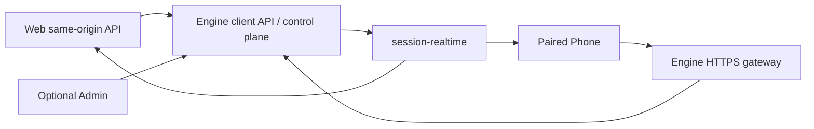

# V8 Agent OS API 参考

本文说明当前 API 的分层、权威来源和主要路由族。它不是内部函数清单；实际请求/响应字段以当前 OpenAPI 与共享契约为准。

## 1. 地址与调用边界

| 层 | 默认地址 | 面向对象 | 角色 |
| --- | --- | --- | --- |
| Engine | `http://127.0.0.1:9530` | 本机客户端、CLI、Admin；远程 Phone 经网关 | `/v1` 控制面、`/api/client` 客户端 API、Owner/配对/设备凭据与执行状态 |
| Admin（可选页面） | `http://127.0.0.1:9527/api/admin` | 控制台页面 | 与 Web 共用一个宿主；配置、治理和诊断代理相应 Engine 管理 API |
| Web | 默认 `http://127.0.0.1:9527/api`，冲突时使用运行时 profile 的 `19527-19546` | Web 页面自身 | 同源代理到 Engine，不创造第二套真相 |

固定规则：

1. Engine 是会话、run、runtime event、审批、产物和恢复状态的权威生产者。
2. Web 通过本机同源代理访问 Engine；Phone 通过 Engine 的受鉴权客户端网关访问产品能力；Admin 不参与会话传输。客户端不得直连 Engine 数据库。
3. Web、Admin、Phone 的实时与历史投影共用 `packages/session-realtime`。
4. 本地 Web/Shell/桌宠是 trusted clients；Phone 是远程 paired client，认证流程不同。Shell 通过本机可信会话和受控通道编排这些入口。
5. 本地绝对路径、secret、raw provider payload、ledger 和 trace 不能直接投影到普通客户端。

## 2. 会话、消息与实时状态

### 2.1 Engine 权威路由

常用入口：

| 方法 | 路径 | 用途 |
| --- | --- | --- |
| `POST` | `/v1/chat/submit` | 提交一轮聊天请求 |
| `POST` | `/v1/chat/upload` | 登记聊天上传来源 |
| `GET` | `/v1/sessions` | 会话列表 |
| `POST` | `/v1/sessions` | 创建会话 |
| `PATCH` | `/v1/sessions/{sessionId}` | 更新标题、展示元数据等 |
| `DELETE` | `/v1/sessions/{sessionId}` | 删除会话并触发关联治理 |
| `GET` | `/v1/sessions/{sessionId}/snapshot` | 当前紧凑快照 |
| `GET` | `/v1/sessions/{sessionId}/runtime-events` | runtime 事件源 |
| `GET` | `/v1/sessions/{sessionId}/history` | 历史投影 |
| `GET` | `/v1/sessions/{sessionId}/turn-index` | 稳定 canonical turn 索引 |
| `GET` | `/v1/sessions/{sessionId}/turns` | 按 turn 拉取内容 |
| `GET` | `/v1/sessions/{sessionId}/timeline/sync` | 增量时间线同步 |

`turn-index` 是导航真相；客户端缓存可以加速首屏，但不能自行重排 canonical turn。reasoning、tool、approval、ask_user、session coordination 等节点有各自结构化类型，不能伪装成用户消息。

### 2.2 Engine 客户端路由

客户端常用入口：

- `POST /api/client/chat-submit`
- `POST /api/client/upload`
- `GET|POST /api/client/conversations`
- `GET /api/client/conversations/{id}`
- `GET /api/client/conversations/{id}/turn-index`
- `GET /api/client/conversations/{id}/turns`
- `GET /api/client/realtime/sessions/{id}/snapshot`
- `GET /api/client/realtime/sessions/{id}/stream`

Web 通过同源代理消费这些 Engine 路由；Phone 使用已配对网关的相同客户端接口。不要在页面里拼接 Engine 本机地址或为 Phone 复制不同字段名。网关按路由、设备身份和权限开放接口，不向远程端开放整个 `/v1` 控制面。

### 2.3 Owner、配对与设备

本机 CLI 和配置页使用 Engine 的 `/v1/client-identity/*` 管理 Owner、一次性配对票据、连接 manifest 和设备撤销。Phone 的配对、refresh 与设备凭据由 Engine 管理；Admin 无须保持运行。常用命令见 [CLI Phone 配置](./V8_AGENT_OS_CLI_REFERENCE_ZH.md#74-phone)。

### 2.4 排序与运行态

- `historySortAt`：历史列表排序真相。
- `lastActivityAt`：综合活动时间，不用于随意重排历史。
- 稳定 run/turn 状态来自 Engine；客户端 focus、点击或本地时钟不能把已运行任务改判为空闲。

## 3. 审批、询问与运行控制

Engine 控制入口包括：

- `GET /v1/approvals`
- `POST /v1/approvals/{approvalId}/approve`
- `POST /v1/approvals/{approvalId}/reject`
- `POST /v1/ask-user/{interactionId}/respond`
- `GET /v1/runs`
- `GET /v1/runs/{runId}/ledger`
- `POST /v1/runs/{runId}/commands/{command}`
- `GET /v1/runtime-episodes/overview`

Spec 阶段同意、ask_user 回答和安全副作用审批是不同语义，客户端不得合并成一种“确认”。Admin 可以展示治理详情，Web/Phone 只展示用户需要理解和操作的内容。

## 4. 工作区、来源与产物

### 4.1 工作区资源

常用 Engine 路由：

- `GET /v1/workspace/resource`
- `POST /v1/sessions/{sessionId}/workbench/files/resolve`
- `GET /v1/sessions/{sessionId}/workbench/files/read`
- `GET|PUT /v1/sessions/{sessionId}/scope`
- `POST /v1/sessions/{sessionId}/scope/re-resolve`

`GET /v1/workspace/resource` 需要 `workspace_relative_path` 和 `path_plane` 查询参数，可选 `workspace_id`、`project_id`。客户端使用 Engine 客户端 API 返回的受限资源引用；本机 Web 可通过同源代理读取，Phone 经网关读取，不使用裸 `C:\...`、`file://` 或 Engine 私网 URL。工作区显示名不改变底层路径和信任边界。

### 4.2 source 与 artifact

| 类型 | 真相 | 是否出现在会话产物概览 |
| --- | --- | --- |
| 用户上传 | source ledger，绑定 session/message | 否，已在用户消息中展示 |
| Agent 写入/下载/Spec/媒体输出 | artifact ledger，绑定 session/run/tool | 是 |
| 工作区已有或手工复制文件 | 普通工作区文件 | 否，除非显式采用 |

相关路由：

- `GET /v1/sources`
- `GET /v1/sessions/{sessionId}/artifacts`
- `GET /v1/artifacts`
- `GET /v1/artifacts/{artifactId}`
- `GET /v1/artifacts/{artifactId}/content`
- `POST /v1/artifacts/adopt-workspace-file`

产物查询必须按会话 lineage 收敛，不能把同一工作区中其他会话或整个目录树混进当前看板。

## 5. Engineering 与 UI Patch

### 5.1 Engineering 控制面

- `POST /v1/engineering-lane/dry-run`
- `GET /v1/engineering-lane/proof-ledger`
- `GET /v1/engineering-lane/workset-observations`
- `GET /v1/projects/{projectId}/engineering-workspace`
- `POST /v1/projects/{projectId}/engineering-workspace/parallel-isolation/enable`

项目工作区路由受安装 profile/knowledge service 影响。非 Git 工作区仍可执行串行、低风险 Engineering；只有用户选择启用 Git 并行隔离时，才允许创建 `.git` 与 V8OS baseline。托管 worktree、sandbox lease 和候选 change set 是可选隔离控制面，不应作为普通文件 API 暴露。

### 5.2 UI Patch Workbench

首版 UI Patch 只面向 Web 的本地 HTML/CSS 与可映射源码的开发页面：

- `POST /v1/sessions/{sessionId}/ui-patch/previews`
- `GET|DELETE /v1/sessions/{sessionId}/ui-patch/previews/{patchSessionId}`
- `POST /v1/sessions/{sessionId}/ui-patch/previews/{patchSessionId}/selections`
- `POST /v1/sessions/{sessionId}/ui-patch/previews/{patchSessionId}/commits`
- `POST /v1/sessions/{sessionId}/ui-patch/transactions/{transactionId}/verification`
- `POST /v1/sessions/{sessionId}/ui-patch/transactions/{transactionId}/undo`

一次 commit 必须能映射源码、产生 diff 并进入验证；不能只改浏览器内联样式后声称已经写回项目。

## 6. 配置、模型与插件

### 6.1 Config Registry

- `GET /v1/config-registry`
- `GET /v1/config-registry/{domain}`
- `POST /v1/config-registry/{domain}`

Registry domain 使用 kebab-case API 名。页面不应直接修改 `~/.v8-agent-os/config.json`。`models` 域提供只读投影；整域写入返回 `410 model_bulk_write_deprecated`，模型变更通过 Model Hub 或 Config Broker 的细粒度事务完成。

### 6.2 模型

主要 Engine 路由族：

- `/v1/models/public`
- `/v1/models/catalog`
- `/v1/models/providers/{providerId}`
- `/v1/models/bindings`
- `/v1/models/control-plane`
- `/v1/models/role-doctor`
- `/v1/models/test-connection`
- `/v1/model-cache/*`

模型显示名不是路由真相。调用需要保留 provider endpoint、API channel、model ID 和 capability；供应商原生 system/tool/reasoning 合同优先，provider-hosted tools 仍受当前工具面约束。

### 6.3 Plugin Manager

Admin 的 `/api/admin/plugins/*` 提供插件管理，代理到 Engine `/v1/api/plugins/*`，包括 catalog、installed、readiness、configuration requirements、OAuth、install jobs、Doctor、uninstall 和 grants。Web/Phone 的 Engine 客户端接口提供 `GET /api/client/plugins/catalog` 与 `GET /api/client/plugins/mentions`，不等于开放全部管理接口。

关键授权规则：

1. `@插件` 是强提示，不是唯一入口。
2. Supervisor 的轻量目录提示只包含已安装插件的能力与状态，不加载 Skill 正文、MCP schema 或 CLI action。
3. `plugin_broker` 只能为当前 run 创建已安装、已配置且健康组件的最小 task grant；安装、补配置和读取 secret 不属于该工具。
4. `plugin_cli` 不在默认工具面，只有有效 grant 投影出受审 profile 后才动态加入。
5. 直接子 Agent 只能获得父级明确组件子集；它可向一层孙 Agent 继续传递更小子集，孙 Agent 不能再传播。
6. 每次执行前重新校验 owner、session/run、delegation identity、manifest digest、组件和健康状态。
7. 上机发现只读：可识别已安装 CLI/官方 Skill，但不接管或修改普通 Extensions MCP 配置；冲突必须显式显示。
8. CLI 只接受 manifest 定义的 `actionId + typed parameters`，不接受任意 shell argv。

凭据只通过 opaque `secretRef` 投影；明文不得进入 API、数据库普通字段、日志或 Agent Surface。

## 7. Checkpoint 与存储治理

### 7.1 Checkpoint Governance

- `POST /v1/checkpoint-governance/plan`
- `GET /v1/checkpoint-governance/operations/{operationId}`
- `POST /v1/checkpoint-governance/operations/{operationId}/execute`

`plan` 创建 replay/fork 操作和审批请求；`execute` 只执行已批准操作。跨用户、跨权限 patch、源状态漂移和插件 grant 继承会被拒绝或失效。checkpoint 使用 strict msgpack 与加密存储，不接受 pickle 或宽泛反序列化兼容。

### 7.2 Storage Retention

- `GET /v1/storage-retention/stats`
- `POST /v1/storage-retention/dry-run`
- `POST /v1/storage-retention/prune`
- `POST /v1/storage-retention/compact`
- `POST /v1/storage-retention/registry/refresh`
- `POST /v1/storage-retention/config`

有副作用的清理应先 dry-run。自动压力处理只针对可丢弃存储类；用户可见转录、未接受 worktree 与恢复证据不能被普通 LRU 当缓存删除。

## 8. 错误与可见面纪律

- Human Surface：状态、结果、阻塞、风险、下一步和可打开产物。
- Agent Surface：紧凑 Markdown 与必要 evidence/detail reference。
- Runtime Surface：完整结构化 ledger、trace、rawRef、metrics 与恢复元数据。

API 出错时保留稳定错误码和可行动摘要；不要把栈、SQL、provider raw JSON 或内部 `run_*` ID 直接扔给普通用户。内部 ID 可在诊断面保留并配合人类可读标签。

## 9. 受信任设备配置分发

本机入口 `/v1/config-distribution` 与 Phone 入口 `/api/client/config-distribution` 均要求已验证 Owner，复用同一持久作业服务。配置分发不向 Phone 开放通用 Config Broker HTTP 写接口。

| 方法与相对路径 | 输入/返回 |
| --- | --- |
| `GET /` | `servingInstanceId/templates/peers/jobs/jobsNextCursor/pendingCount`，未完成优先的前 20 个摘要 |
| `GET /jobs?cursor=…` | 后续 20 个摘要；列表不包含目标 diff/receipt，详情按需读取 |
| `GET /local-workspaces` | 当前 Engine 本地项目、目录、信任状态与连接版本，只对 Owner 返回 |
| `POST /local-workspaces/{linkId}` | `{projectId,projectRevision,linkRevision,trustConfirmed:true}`，复用本地项目信任及 Network link owner；不接受绝对路径输入 |
| `GET /targets/{linkId}` | 目标本地 `roles/models`、`missingRequirements`、`protocolVersion:1`、`pathPolicy:target_local_only` |
| `POST /` | `{commandId,templateId,targets:[{linkId,mapping:{roles,models}}]}`，准备白名单模板 |
| `GET /{jobId}` | 作业版本、状态及逐台 diff/receipt/readback |
| `POST /{jobId}/confirm` | `{commandId,revision,planDigest}`，确认当前已准备目标 |
| `POST /{jobId}/{prepare,retry,cancel,withdraw}` | `{commandId,revision}`，重新准备、续作原计划、取消未提交或精确撤回 |

完整作业返回 `intent/allowedActions` 与逐目标 `approved/mapping`，客户端据此显示真实可用恢复动作。`prepare` 可附 `targets:[{linkId,mapping}]` 修改未确认目标；已确认映射不可变。未知提交先对账原事务；较新代次尚未送达时取消也会在接收端保留幂等终止记录。撤回遇目标后续更新会进入 `withdrawal_conflict`，保留目标配置并指导本地处理。

`model-policy` 仅含白名单预算标量与内置角色温度；`model-roles` 仅含源角色身份和目标本地模型映射。每台目标的 `diff` 为 `{field,before,after}[]`；`receipt` 绑定 Broker 事务、计划摘要、目标授权版本和到期时间，成功后附白名单字段的扁平 `readback`。

批量确认校验 `revision/planDigest`，目标计划有效期 15 分钟。重复 Owner/commandId 返回同一作业；不同请求体复用 ID 返回 `distribution_command_reused`。旧版本、改目标、撤销信任、取消后的迟到确认及较新的目标配置均不能绕过提交约束。部分成功为 `partial`，全部目标提交并读回后才是 `completed`。

传输复用 `/v1/network-supervisor/peer/neighbors/messages` 的现有 peer token 和签名 envelope，消息类型为 `config.distribution.{capabilities,prepare,apply,status,cancel,withdraw}`，载荷版本为 `protocolVersion:1`，响应为同名 `.ack`。接收端只接受已信任 primary 发给 companion 的白名单意图；对端本地 Broker 负责实际事务。旧 Engine 不支持该消息类型时拒绝请求，所有参与设备需升级。

## 10. 验证入口

- Engine OpenAPI：启动后查看 `/docs` 或 `/openapi.json`。
- 共享契约：`packages/session-realtime` 的构建与测试。
- Engine 测试地图：[apps/v8-agent-os-engine/tests/README.md](../apps/v8-agent-os-engine/tests/README.md)。
- 桌面真实烟测：`.\v8os.cmd preview --rebuild`。

修改 API 时同步检查 Engine 源头、受影响的客户端/管理代理、共享契约、Web 与 Phone 消费方，并验证实时、历史和重新加载的结果一致。
