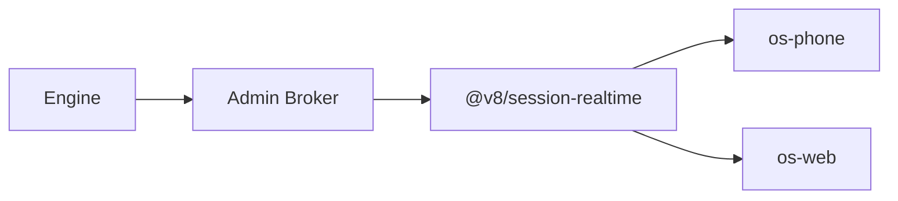
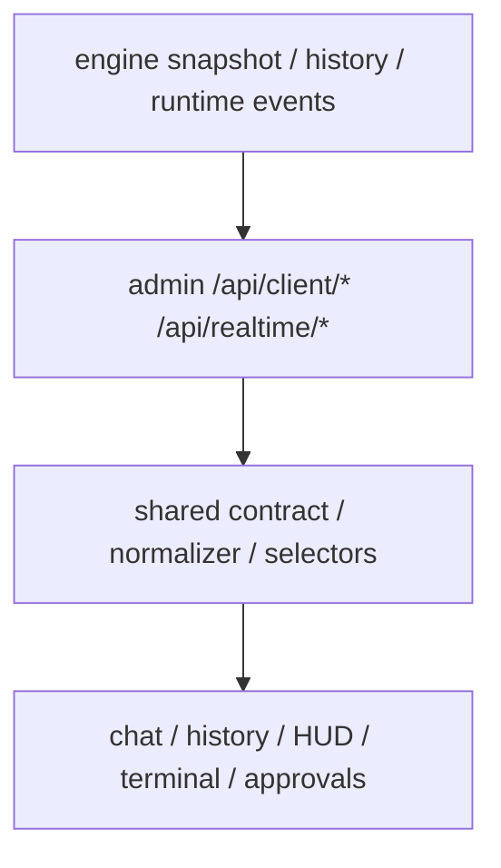

# V8 Agent OS API 参考（项目级）

适用范围：

- `E:\Projects\v8chat\v8-agent-os`
- `E:\Projects\v8chat\v8-agent-os-site`

本文不是“只列路径”的旧式接口表，而是帮助你理解当前 API 和 broker 主链。

---

## 1. 先记住 6 条规则

1. `engine` 是实时态与历史态的唯一 authoritative producer。
2. `admin` 是唯一远端 broker。
3. `phone/web` 应只依赖 `admin`，不应直连 `engine`。
4. 当前主聊天 surface 的 state 必须经过 shared contract。
5. 资源 URL、artifact、process 引用必须先经过 `admin` 规范化。
6. `os-phone` 是主远端 surface，`os-web` 是备用 surface；API 契约可以共用，产品角色不对称。

---

## 2. 总体拓扑

再展开一层：

---

## 3. Engine：authoritative truth 层

Engine 负责：

1. session / run / runtime events / snapshot / history 真相
2. approval / ask_user / governance / controls 真相
3. artifact / context reference / process / todos authoritative payload
4. memory / safety / runtime stability 维护逻辑

典型 engine 真相源包括：

- `/v1/sessions/{id}/snapshot`
- `/v1/sessions/{id}/runtime-events`
- `/v1/sessions/{id}/history`
- `/v1/workspace/resource`

原则：

- `engine` 输出 authoritative state
- 不负责给 `phone/web` 直接提供远端可用 URL 语义
- 更不应该让 `phone/web` 直接依赖其私网地址

---

## 4. Admin：唯一 broker 层

Admin 负责：

1. 代理 `engine`
2. 规范化 payload
3. 附加 signed URL / reachable URL
4. 管理认证与 surface origin
5. 暴露 `phone/web` 统一 client-facing API

常见入口：

- `/api/client/*`
- `/api/realtime/*`
- `/api/conversations/*`
- `/api/client/workspace/resource`

固定纪律：

1. `phone/web` 不要绕过 `admin`
2. 不要把 `localhost`、本地绝对路径、engine 私网 URL 直接下发给远端 surface
3. 所有 artifact / workspace file / process link 都应先 broker 再消费

---

## 5. Shared Contract：`packages/session-realtime`

`packages/session-realtime` 当前承担：

1. snapshot schema
2. history schema
3. realtime event taxonomy
4. selector / normalize / CDC store 派生

关键点：

- `admin / phone / web` 共用同一 contract
- contract 对称，但产品角色不对称
- 不能为了某一端方便，在页面层私自发明第二套 schema

---

## 6. Surface 角色与 API 消费纪律

### 6.1 `os-phone`

- 主远端交互面
- 主验收面
- 优先验证聊天、runtime HUD、artifact、approval、file share、memory 可见性

### 6.2 `os-web`

- 备用 surface
- 主要用于桌面回归、调试、排障
- 不再是主用户面

### 6.3 `v8-agent-os-site`

- 对外站点
- 安装入口与公开文档导航
- 不定义新的 runtime/API 真相

---

## 7. 资源与文件 API

### 7.1 workspace / project workspace 资源

正式资源分享与预览应走：

- scoped workspace resource resolver
- `share_workspace_file`

不要再依赖：

- 裸 `C:\...`
- 任意本地绝对路径
- 未 broker 的 engine 私有 URL

### 7.2 artifact / resourceRef 纪律

资源可预览性以 canonical artifact/resourceRef 为准。

说明：

1. `workspacePath/sourcePath` 只适合显示文案
2. `resourceRef.adminPath/signedUrl` 才是远端可消费 surface
3. `channel_delivery_stage` 不并入 main/project workspace plane

---

## 8. 插件管理中心 API 边界

插件目录、安装任务、配置、Doctor、卸载和授权统一位于 `/api/plugins/*`。普通 Extensions API 只管理通用 Skill/MCP 候选，不返回插件拥有的组件。Web/Phone 的 `@插件` 是强提示并可创建用户选择的 task/session grant；除此之外，Supervisor 可通过 `plugin_broker` 为当前 run 创建已安装、已配置且健康插件的最小 task grant。只有有效授权才会精确投影该插件允许的 Skill、MCP Tools 与结构化 CLI 入口。

Supervisor 不能通过该入口安装插件、补配置、读取密钥或创建长期 session grant。向子 Agent 委派时只能复制父级已授权的明确组件子集，且不能继续向孙 Agent 传播。

CLI 执行禁止接收任意 shell 字符串；系统安装、部署、删除、付费与云资源写入继续经过安全审批。

---

## 9. 时间、排序与远端真相

当前固定语义：

1. Engine 是远端 authoritative time
2. `historySortAt` 是历史列表排序真相
3. `lastActivityAt` 只表示 runtime 综合活动，不应再驱动历史排序
4. `phone/web` 本地时间只适合 optimistic UI 和格式化显示

因此：

- 点击会话
- 刷新 snapshot
- process polling

都不应再让会话列表无端漂移。

---

## 10. 推荐阅读顺序

1. [V8 Agent OS 开发者指南](./V8_AGENT_OS_DEVELOPER_GUIDE_ZH.md)
2. [V8 Agent OS 配置指南](./V8_AGENT_OS_CONFIG_GUIDE_ZH.md)
3. `docs/Govern/*`
4. `docs/phone/*`
5. `docs/computer/*`
