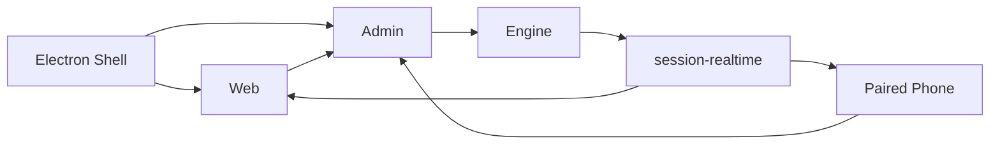

# V8 Agent OS 开发者指南

本文面向需要跨 Engine、Admin、Web、Phone、Shell、Desktop Pet、CLI 与共享包定位问题或新增能力的贡献者。

## 1. 当前总纲

V8OS 当前主线是：

> 桌面优先、Supervisor First、Runtime Grounded，把长期项目执行收成可治理、可恢复、可验证的产品闭环。

优先级：

1. 当前用户意图与正确性；
2. 权限边界和真实执行；
3. 可恢复性与证据；
4. Human Surface 的可理解性；
5. 跨客户端契约一致性；
6. 开发速度与兼容性。

聊天 Planner 已物理删除。Memory、runtime hint、gate、插件目录提示都只能提供证据或护栏，不能建立第二个指挥层。

## 2. 仓库与产品面

### 2.1 主产品仓

`v8-agent-os` 包含：

- `apps/v8-agent-os-engine`：权威运行核心；
- `apps/v8-agent-os-admin`：控制台与客户端 broker；
- `apps/v8-agent-os-web`：桌面主聊天/工作区；
- `apps/v8-agent-os-phone`：配对后的远程交互面；
- `apps/v8-agent-os-shell`：Electron 桌面壳、托盘和本机控制；
- `apps/v8-agent-os-desktop-pet`：受 Shell 管理的桌宠；
- `apps/v8-agent-os-cli`：本机服务、预览、诊断和会话 CLI；
- `packages/session-realtime`：共享实时/历史契约。

### 2.2 公开站点仓

`v8-agent-os-site` 只负责落地页、安装入口和公开叙事。它不得定义 runtime 真相，也不得把服务 bootstrap 误写成完整桌面安装器。

### 2.3 Surface 角色

| Surface | 角色 | 不能做什么 |
| --- | --- | --- |
| Web | 桌面主聊天、任务、产物与工作台 | 直读 Engine DB、发明第二套 runtime state |
| Admin | 配置、治理、诊断、API broker | 变成第二个聊天面、把 raw ID/JSON 当普通 UI |
| Phone | 唯一远程 paired client | 冒充本机 trusted client |
| Shell | 本机窗口、托盘、主题和桌宠控制 | 承载 runtime 业务真相 |
| Desktop Pet | 会话状态伴随器 | 自建第二套托盘、会话或认证真相 |
| Site | 公共产品说明 | 宣传未验证能力或内部实现细节 |

## 3. 权威链与 API 链

排查用户可见状态时按以下链路反查：

1. Engine 是否产出正确 authoritative state/event；
2. Admin 是否正确认证、代理并规范化资源引用；
3. `session-realtime` 是否统一 snapshot/history/realtime；
4. Web/Phone selector 是否只派生展示状态；
5. 组件是否保留事件顺序和语义。

页面局部 reducer 不能成为会话运行真相。Web/Phone 也不能根据 focus、点击或本机时间重新判定远端 run 状态。

## 4. Runtime 与支撑平面

主动执行能力：

- `chat` / Supervisor；
- `engineering`；
- `research`；
- `creative_media`；
- `computer_use`；
- `rpa`；
- delegation/subagent。

按需支撑能力：

- `memory`；
- `automation`；
- `extensions`；
- `plugin_manager`；
- `network_supervisor`；
- runtime/checkpoint/storage governance。

复杂执行真相位于 `runtime_episodes`、queue、lease 与 handoff。`route_context` 只保留兼容快照和紧凑 prompt 摘要。

Engineering episode 是持久执行、依赖、证明和恢复控制层，但不是 Supervisor 实施代码的强制入口。不要因为文本里出现“代码”就无条件绕行或阻止 Supervisor 直接工作。

## 5. Engineering Kernel 与工作模式

`core/engineering_kernel.py` 在协作角色开始工作前提供：

- 当前绑定工作区；
- workspace state digest；
- OS、shell dialect 与命令语言；
- actor role；
- Supervisor `daily / engineering` 模式；
- Engineering Task Capsule 摘要（如有）。

因此：

- 不再用 `workspace_broker` 重复发现工作区；
- Supervisor 在两种模式下都可按需使用通用文件/命令工具；
- Engineering 模式适合长期项目，但 delegation/runtime episode 仍是可选策略；
- 非 Supervisor 在无 Capsule 时不得写文件或运行 shell，只能返回 blocker 或请求正确路由。

命令 dialect 来自环境检测，不写死 Windows。工具描述、任务合同和实际执行必须使用同一 dialect。

## 6. Actor、工具与委派合同

### 6.1 稳定角色

- Supervisor；
- direct subagent；
- grandchild；
- runtime internal。

角色由显式 `actorRole`、delegation identity 和 depth 解析；不能仅凭 runtime kind 把 Supervisor 误降为 subagent。

### 6.2 工具边界

| 工具/能力 | Supervisor | 直接子 Agent | 孙 Agent |
| --- | --- | --- | --- |
| `runtime_broker` | 是 | 否 | 否 |
| `spec_broker` | Spec 激活时 | 否 | 否 |
| `agent_broker` | 是 | 否 | 否 |
| `delegation_broker` | 是 | 是 | 否 |
| `request_peer_help` | 按 runtime access | 按 runtime access | 否 |
| `plugin_broker` | 授权/查询 | 仅精确 grant 查询或向父级请求 | 仅精确 grant 查询 |
| `plugin_cli` | 有效 grant 动态投影 | 有效精确 grant 动态投影 | 有效精确 grant 动态投影 |

手工委派必须使用注册 Agent 的精确 `targetAgentName`。`familyHint` 是匹配元数据，不是猜目标的权限。

委派任务必须保留 taskBrief/delegation ID、父子 lineage、目标、状态、artifact refs、自检、验收提示、父级 acceptance 与缺失证据。父级必须显式 accept/retry/ignore；不能把子 Agent 原始回流压成一句话。

本地 delegation result 由图内 handoff 注入。Supervisor/父 Agent 禁止轮询状态来驱动主链；异常时发布降噪 progress 和紧凑执行轨迹。

### 6.3 孙 Agent

孙 Agent 是终止层：不能继续委派。默认派生 `verify` Capsule，独立读取和验证父级结果，不写临时报告文件。只有任务明确提出写入、且请求路径是父 `writeSet` 的严格真子集时，才能获得 write Capsule。

## 7. Engineering Execution 与按需隔离

四层不能混为一个路径或权限位：

| 层 | 负责 |
| --- | --- |
| Workspace | 用户项目身份、信任、scope 和可见文件 |
| Git repository | diff、版本与 merge 真相 |
| Managed worktree | 单个 run/task/delegation 的隔离 checkout |
| Sandbox lease | 一次执行的进程、资源、环境、写集和证据策略 |

执行策略：

1. 所有写入先要求已信任的绑定工作区和完整 Engineering Task Capsule，至少包含精确 `writeSet`、期望产物与验收。
2. 串行、低风险写入直接在绑定工作区执行；变更只走受 `writeSet` 约束的原生文件工具，shell 用于读取和验证，不把 worktree 当作 Engineering 的默认前置步骤。
3. 只有完整写入合同同时满足并行隔离、风险控制或长期恢复之一时，才创建 managed worktree 与不可变 sandbox lease。
4. 现有非 Git 工作区进入托管隔离前必须由用户显式采用；普通任务不得静默 `git init`、创建 baseline、移动分支、改变 index 或替用户提交。
5. 进入隔离后，dispatch 通过 alternate index 捕获 tracked/untracked 状态；需要隔离的 Supervisor、子 Agent 或外部 worker 使用各自 worktree。
6. 子 change set 合并到父 worktree，并列候选在 integration worktree 汇总；只有通过验证的 Supervisor delivery 才把 patch 应用到原工作区。
7. 已接受交付写入 `refs/v8os/delivered/...` 恢复引用并清理物理 checkout；失败/中断 worktree 保留为 recoverable。

当前 enforcement 是 `partial`：跨平台具备进程树生命周期、资源限制、环境 allowlist、路径预检、不可变写集、Git diff 验证和 20 MiB 文件门禁，但没有硬文件系统 namespace 或硬离线网络 namespace。`offline_enforced` / `brokered` 在不支持的平台必须 fail closed。

## 8. Canonical、实时与可见面

`packages/session-realtime` 负责：

- event taxonomy；
- snapshot/history/turn schema；
- canonical node 与 card 语义；
- live/history parity；
- selector、normalize 与 CDC 派生。

关键 invariant：

- assistant narrative 不包含 `<think>`；reasoning 只进入 reasoning node；
- 有 structured nodes 时不再从 `content_text` 猜语义；
- `turn-index` 是稳定导航真相；
- governance、session coordination 和工具状态不能冒充 canonical user message；
- 历史读取兼容修复不能改写原数据库版本和时间戳。

Human Surface 只显示状态、结果、阻塞、风险、下一步和人类可读产物。raw payload、内部 ID、ledger、trace 和恢复元数据留在 Runtime Surface。

## 9. 来源、产物和工作台

- 用户上传进入 source ledger，绑定 session/message，并在用户消息中展示。
- Agent 写入、下载、Spec 与 Creative Media 输出进入 artifact ledger，绑定 session/run/tool lineage。
- 工作区已有文件或手工复制文件不会被扫描后自动升级为 artifact；显式采用走治理 API。
- 当前会话产物看板不得混入同工作区其他会话、整个目录或用户上传的重复卡片。
- 资源预览走 scoped resolver 与 Admin broker，不向远程端发送裸绝对路径或 `file://`。
- Creative workspace library 归工作区，可在同一工作区跨会话发现；当前会话必须显式采用后才能使用。跨工作区引用拒绝，mask 等内部编辑资源不进入普通素材库。

UI Patch Workbench 是 Web 专属全尺寸工作台。一次修改必须完成 DOM 选择到源码映射、白名单属性 patch、diff、保存验证和精确 undo；不支持任意互联网页面、无法映射的生产压缩页面或“只改 inline style”的假保存。

Creative Artifact Canvas 也是 Web 专属工作台。它组织当前会话产物与已采用的工作区素材，支持媒体卡片、连线、框选、蒙版局部编辑和受治理的 Creative Media 动作；运行中锁定会破坏 lineage 的自由修改。typed Canvas Graph 以 Engine snapshot/event 为真相，绑定当前 Session/Workspace 后直接进入 Creative Media Runtime；页面只做投影和交互，不建立旁路状态。输出版本持有自己的资源、Provider/model/recipe、耗时、成本与 QA 证据，Review 通过 revision fence 批准、拒绝和选择交付版本。精确抽帧、视频分段与音频分段由 Engine 自有媒体路径执行，要求配对的 FFmpeg/FFprobe 7+，并通过 probe fingerprint、frame index/time base 或 sample index 验证边界，不经过 provider 或 MediaKit 插件。

## 10. 模型与 provider 合同

模型控制面区分：

- provider endpoint；
- API channel/protocol；
- provider-native model ID；
- capability；
- role binding。

目录 JSON 是便利服务，不能覆盖用户真实配置。Anthropic/OpenAI 等 provider-native system、tool 与 reasoning 消息合同应保留；provider-hosted tools 必须经过当前绑定工具面和 schema allowlist，不能因供应商支持而自动扩权。

媒体 provider/model route 与普通文本模型 ID 分离，Creative Media job 通过标准 facade 和模型 binding 解析。

## 11. Plugin Manager 与 Extensions

普通 Extensions 与 Plugin Manager 分层：

- Extensions 负责普通 Skill/MCP 候选、审查和预筛；
- Plugin Manager 负责签名 catalog、组件策略、上机发现、持久安装事务、配置需求、凭据引用、授权和执行投影。

当前关键合同：

1. catalog 带 key ID、revision/sequence、有效期、撤销列表和 digest；包版本/Skill commit 固定。
2. 上机发现后台、只读、非阻塞；识别外部 CLI 和官方 Skill，但普通用户 MCP 只报告、不接管。
3. 冲突 Skill 不覆盖；安装计划按平台选择最小组件组合并保留事务 journal、digest、幂等键和 receipt。
4. MCP 初始化和插件发现不能阻塞 Engine 启动。
5. Supervisor 只收到已安装插件的紧凑 catalog hint；它不加载 Skill body、MCP schema 或 CLI action。
6. `plugin_cli` 从默认工具面移除，只在 active grant 投影受审 profile 后加入。
7. `@插件` 与 Supervisor 最小 task grant 都是受治理入口；安装、补配置、secret 读取和持续 session grant 仍由用户控制。
8. 直接子 Agent 只能获得明确组件子集；一层孙 Agent可获得更小子集，再往下拒绝。
9. 每次调用重新校验 owner、session/run、delegation identity、manifest digest、组件和健康状态。
10. CLI 只接受 `actionId + typed parameters`，禁止任意 argv/shell 字符串。
11. 插件 Skill/MCP 安装到现有 `~/.agents/skills` 与 `~/.v8-agent-os/mcp.json` 真相面；插件不创建私有资源仓。普通任务仍由 Extensions 预筛，只有“已注册 + 已安装 + 有效 grant”同时成立时，当前 run 才临时投影该插件包的精确组件。
12. Skill 正文和关联资源继续由通用 `fetch_skill_instructions` 按需读取；不额外制造插件专用 Skill 工具，也不把完整 SKILL.md 常驻注入。
13. 支持 schema 的 CLI 必须同步当前安装版本的完整 action/parameter 定义并记录版本摘要；升级 harness 比较新增、删除和类型变化，未审阅的破坏性变化阻断投影，不能为了稳定而削掉 CLI 的正式能力。
14. CLI 登录适配器只能暴露受审动作和人类可读状态。GitHub/Cloudflare 等浏览器登录由官方 CLI 发起，token 留在其安全 profile/keyring；V8OS 不解析授权 URL 中的秘密，也不向 Agent 或日志回显凭据。

## 12. Checkpoint 与存储治理

Checkpoint：

- strict msgpack；
- secure credential store 中的加密密钥；
- 历史明文行原子加密/压缩；
- plan/fork/replay 需审批；
- 跨用户、跨权限 state patch、源状态漂移和 plugin grant 继承拒绝或失效。

Storage Retention：

- 自动压力清理只处理可丢弃 storage class；
- 用户转录、未接受 worktree、checkpoint 与交付证据受保护；
- worktree 默认放在同卷隐藏目录，自定义根也必须同卷；
- accepted worktree 及时清理，失败/中断 worktree 保留恢复语义。

有副作用的 prune/compact 先 dry-run，再执行，并记录可重放证据。

## 13. 配置与启动

主配置真相是 `~/.v8-agent-os/config.json`；MCP、用户、Supervisor Markdown、state/checkpoint DB、Computer Use 和 Network Supervisor secret/state 有独立真相面。详细映射见[配置指南](./V8_AGENT_OS_CONFIG_GUIDE_ZH.md)。

本机命令：

- `v8os start`：Engine + Admin + Web 服务，不打开 Shell；
- `v8os preview`：构建缺失产物并启动完整桌面预览；
- `v8os preview --rebuild`：停止当前源码树拥有的 Shell/Admin/Web/Engine 后重建并重启；
- 裸 bootstrap：依赖准备与服务启动，不是桌面安装包。

## 14. 排查顺序

### 14.1 Agent 行为异常

依次检查：

1. 实际 actor role/delegation depth；
2. 最终 system prompt 和 Engineering Kernel；
3. 当前工具列表与每个工具描述；
4. Capsule、plugin grant、runtime access；
5. Spec/Memory/gate 动态注入；
6. tool output 是否把 runtime 内部噪音投给 Agent；
7. handoff 是否无损、是否被父级明确验收。

不要先靠加一句 prompt 或固定失败文案掩盖权限链错误。

### 14.2 页面状态不一致

依次检查 Engine snapshot/event、Admin proxy、`session-realtime`、客户端 selector、组件。对比 live 与 history，而不是只修其中一条路径。

### 14.3 插件问题

依次检查签名 catalog、component policy、machine discovery、install journal/receipt、configuration requirement、credential ref、readiness、grant identity 和动态工具投影。

### 14.4 工程写入问题

先检查 workspace trust 与 Capsule 的 `writeSet / expectedOutputs / acceptance` 是否完整，再检查执行策略是否正确：串行低风险任务应直接使用绑定工作区；只有并行、风险隔离或长期恢复才检查 Git 并行隔离、worktree/lease、command preflight、change set、parent/integration merge 和 Supervisor delivery。不要把缺少 Git 误报为整个 Engineering 不可用。

## 15. 测试与交付门禁

- Engine 测试地图：`apps/v8-agent-os-engine/tests/README.md`。
- 改共享契约：构建/测试 `packages/session-realtime`，必要时重新 pack tgz，并验证 Admin/Web/Phone。
- 改桌面壳、生产 Next、登录态、托盘、桌宠或 Engine 启动：必须额外跑 `v8os preview --rebuild`。
- 改 CLI：同步检查命令注册、`--help`、人类输出/`--json`、退出码、Windows `v8os.cmd`/PowerShell 入口和打包资源路径；后台进程必须无窗口启动，源码树与打包形态分别 smoke。
- 改 Shell：同时检查 main/preload/renderer bridge、IPC 与 deep-link allowlist、tray state、主题/当前会话同步和打包资源；受控设置入口复用现有窗口，不能误开系统浏览器。
- 改桌宠：验证 Shell managed mode、单实例、控制通道状态、当前会话同步、配置热更新、息屏动画/shutdown ack、超时强制兜底、Shell 异常退出 watchdog 和 preview 重启重连；managed mode 不得再建独立托盘。
- 改插件 CLI：联查 catalog/digest、安装 journal/receipt、上机发现、Doctor/登录状态、全量 schema 同步、typed parameters 和逐次 grant 校验；“已安装”不能替代“已配置、健康且当前调用获授权”。
- 改写入/安装/清理/恢复：必须有 dry-run、故障注入、重启恢复和 rollback 证据。
- 真实 provider、联网调研、媒体生成和高成本 eval 只在显式 `--live` harness 中运行。
- 重大改动比较基线；性能退化超过 10% 或错误率增加超过 0.1% 不交付。

提交前至少执行：相关定向测试、`git diff --check`、工作树范围检查和可逆回滚检查。脏工作树只提交本轮文件，不吞并其他线路改动。

## 16. 文档与公开叙事

- README/快速开始写用户能执行的路径，不写内部交付报告。
- API/开发者指南明确权威层、权限和失败边界，不把 mock 当真实验收。
- Site 只宣传已提交且有代码/测试事实的能力。
- Windows unsigned preview、Phone APK、TUI 未实现、轻量版长期规划等状态必须如实区分。
- 服务 bootstrap 与 Electron Desktop Preview 是两种入口，任何公开页面都不能混写。

继续阅读：

- [API 参考](./V8_AGENT_OS_API_REFERENCE_ZH.md)
- [配置指南](./V8_AGENT_OS_CONFIG_GUIDE_ZH.md)
- [Managed Engineering Execution](../apps/v8-agent-os-engine/core/engineering_sandbox/README.md)
- [Engine 测试地图](../apps/v8-agent-os-engine/tests/README.md)
