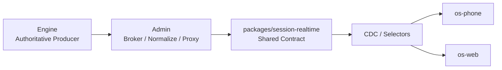

# V8 Agent OS 开发者指南（项目级）

适用范围：

- `E:\Projects\v8chat\v8-agent-os`
- `E:\Projects\v8chat\v8-agent-os-site`
- `E:\Projects\v8chat\openclaw-v8-bridge`

读者：

- 需要在 `engine / admin / phone / web / packages / bridge` 间定位问题的人
- 需要新增 runtime 能力、治理能力或生态桥接能力的人
- 需要理解当前主链和兼容边界的人

---

## 1. 一句话总纲

> V8 Agent OS 当前的核心任务不是继续堆聊天功能，而是把系统收成一台统一、可恢复、可观测、phone-first 的 runtime 机器。

固定价值排序：

1. 正确性
2. 可恢复性
3. 可观测性
4. runtime 一致性
5. 兼容性
6. 开发速度

---

## 2. 多仓与 surface 角色

### 2.1 多仓职责

#### `v8-agent-os`

主产品仓，包含：

- `apps/v8-agent-os-engine`
- `apps/v8-agent-os-admin`
- `apps/v8-agent-os-phone`
- `apps/v8-agent-os-web`
- `packages/*`

#### `v8-agent-os-site`

公开站、安装入口、对外叙事仓，不定义新的 runtime 真相。

#### `openclaw-v8-bridge`

OpenClaw / `plugin_host` / channels / handoff 桥接仓，属于 runtime 主链的一部分，不是可忽略插件。

### 2.2 Surface 角色

- `os-phone`：主远端交互面、主验收面
- `os-web`：备用 surface，用于桌面调试、回归、排障
- `admin`：控制与观测面
- `engine`：唯一 authoritative producer

这里要强调：

> contract 可以对称，但产品角色不对称。

`web` 与 `phone` 可以共用 shared contract，但当前主线体验与验收中心是 `phone`，不是“双主面”。

---

## 3. 当前主链

任何需要进入用户可见层的状态，都应该能沿这条链回溯：

1. `engine` 产出了什么 authoritative state
2. `admin` 是否做了规范化、资源 broker、权限代理
3. `packages/session-realtime` 如何解释 snapshot/realtime/history
4. selector/CDC store 如何派生组件状态
5. 组件最终如何显示

如果一个字段只存在于页面局部 reducer，而无法回溯到 `engine -> admin -> shared contract`，它大概率不是主链字段。

---

## 4. packages：共享契约层而不是边角目录

`E:\Projects\v8chat\v8-agent-os\packages` 当前最关键的是：

- `packages/session-realtime`

它负责：

1. realtime event taxonomy
2. snapshot / history shared schema
3. artifact / process / context reference 共享语义
4. normalize / selector / CDC store 派生规则

修改它时必须默认联动：

1. `apps/v8-agent-os-admin`
2. `apps/v8-agent-os-phone`
3. `apps/v8-agent-os-web`

默认纪律：

1. 改源码
2. `build`
3. 如消费端锁定 tarball / packed 包，则同步 `pack`
4. 重新安装消费端依赖
5. 至少做一轮 `admin / phone / web` build 或 typecheck 验证

---

## 5. 当前主线 runtime family

当前纳入主聊天 / 主实时链的 family：

1. `chat`
2. `automation`
3. `extensions`
4. `network_supervisor`
5. `computer_use`
6. `rpa`
7. `plugin_host_tool`

当前不进入主聊天 realtime CDC 的 family：

1. `memory`
2. `desktop_live`
3. `plugin_host_channel`

这三类并不是不重要，而是它们属于不同 plane：

- `memory`：底层长期记忆与维护面
- `desktop_live`：手工驱动协作面
- `plugin_host_channel`：外部 channel 历史面

---

## 6. 配置与工作区真相

主配置真相：

- `~/.v8-agent-os/config.json`

重点域：

- `models`
- `mcp`
- `memory`
- `supervisor`
- `workspace`
- `projects`
- `safety`
- `audio`
- `runtimeRegistry`
- `systemBase`
- `extensions`
- `computerUse`

独立关键文件：

- `users.json`
- `V8_AGENT_OS.md`
- `state.db`
- `checkpoints.db`
- `plugin.json`
- `computer_use.json`
- `network_supervisor_secrets.json`
- `network_supervisor_state.json`

迁移与排障时必须明确：

- `~/.v8-agent-os` 是当前 canonical root
- `~/.v8chat` 只是历史残留/迁移输入，不应继续当主链真相

---

## 7. 资源、artifact 与 workspace 文件

当前关于文件与资源的纪律：

1. 用户可见资源必须先资源化，再进入 surface
2. `admin` 负责 broker / normalize / signed URL / reachable URL
3. `phone/web` 不应从本地绝对路径猜资源真相
4. main workspace 与 project workspace 需要走 scoped resolver
5. `channel_delivery_stage` 不属于 main/project workspace plane

主动分享工作区文件的推荐主链是：

- `share_workspace_file`

它应被理解为：

- 会话内主动分享工具
- 不是 artifact store 污染入口
- 输出的是远程可消费 resource surface，而不是“把本地路径直接发给用户”

---

## 8. plugin_host / bridge / OpenClaw

任何涉及下列主题的改动，都应按主链处理：

- `plugin_host`
- OpenClaw channels
- managed tool bridge
- handoff token
- gateway catalog
- local state manifest

联查目录至少包括：

- `E:\Projects\v8chat\openclaw-v8-bridge`
- `E:\Projects\v8chat\v8-agent-os\apps\v8-agent-os-engine\core\plugin_host`

判定标准：

1. fail-closed 是否仍成立
2. allowlist / canonical tool name 是否仍一致
3. inbound URL / gateway token 是否仍安全
4. handoff 语义是否仍可恢复

---

## 9. 典型排查顺序

### 9.1 聊天显示不一致

优先顺序：

1. `engine` snapshot / runtime events
2. `admin` normalize / proxy / resource broker
3. `packages/session-realtime`
4. `phone/web` CDC selector
5. 组件自身渲染

### 9.2 配置没生效

优先顺序：

1. `storage.py`
2. `config_registry_routes.py`
3. 本机 `~/.v8-agent-os/config.json`
4. 独立配置文件
5. 页面默认值与旧文案

### 9.3 OpenClaw / plugin_host 问题

优先顺序：

1. `openclaw-v8-bridge`
2. `plugin_host` runtime
3. gateway / channel / manifest / secrets
4. 再看具体 surface

---

## 10. 当前固定结论

1. `os-phone` 是主远端交互与主验收面。
2. `os-web` 保留，但定位为备用 surface。
3. `admin` 是唯一对远端 surface 暴露的 broker。
4. `engine` 是唯一 authoritative runtime producer。
5. `packages/session-realtime` 是 `admin / phone / web` 的共享契约层。
6. 兼容壳只保护外部行为，不应继续充当内部真相。

---

## 11. 推荐继续阅读

1. [V8 Agent OS API 参考](./V8_AGENT_OS_API_REFERENCE_ZH.md)
2. [V8 Agent OS 配置指南](./V8_AGENT_OS_CONFIG_GUIDE_ZH.md)
3. `docs/Govern/*`
4. `docs/phone/*`
5. `docs/computer/*`

