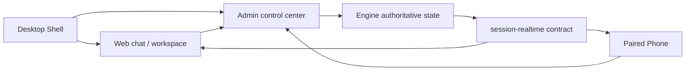

# V8 Agent OS 快速入门

本文面向第一次安装、从源码启动或参与联调的开发者与测试者。内容以当前 `main` 分支和公开 Preview 通道为准。

## 1. 先建立正确的产品心智

V8 Agent OS 当前是桌面优先、本地优先的 Agent 工作空间：

- Desktop：主产品面，由 Engine、Admin、Web、Electron Shell 和受控桌宠组成。
- Web：桌面壳中的主聊天与任务工作区，也是浏览器可访问的本机交互面。
- Admin：模型、工作区、记忆、插件、运行治理和系统配置中心，同时为客户端代理 Engine API。
- Engine：会话、运行、事件、产物、审批和恢复状态的权威生产者。
- Phone：唯一远程交互面，需要配对；用于远程续接任务、回答问题、发送语音或文件和查看产物。
- `packages/session-realtime`：Web、Phone 与 Admin 共用的实时/历史投影契约。

Phone 不是桌面版的替代品，Web 也不是调试备用页。桌面 Web 是当前主交互面，Phone 是配对后的远程延伸。



## 2. 选择一种启动方式

### 2.1 下载 Windows 桌面预览版

普通试用优先前往 [GitHub Releases](https://github.com/justForever17/v8-agent-os/releases)。首个 `v8-os-vYYYY.MM.DD.N` 统一 Preview 完成真实验收后，应从该 Release 下载对应架构的 Windows 资产；同一 Release 会列出 macOS、Linux 和 Android Phone 产物，以及覆盖全部公开下载文件的 `SHA256SUMS.txt`。在首个统一 Release 验收完成前，只能把已有分产品 Preview 当作过渡期下载，不能据 schema 或 workflow dry-run 宣称统一发布已经成功。

当前桌面版仍是 unsigned preview：Windows 可能显示安全确认；签名、自动更新和 stable 通道尚未完成。Android 是统一发布的必需产物；iOS 因尚未配置非交互签名凭据而明确 disabled/skipped，等待签名、注册设备和真实安装验收后再进入发布矩阵。

`v8-os-desktop-v*` 与 `v8-os-phone-v*` 是过渡期兼容 tag，自首个成功统一 Release 起保留两个成功统一发布周期后废弃；旧 `desktop-v*` / `phone-v*` 仅作历史记录。下载时应优先选择统一 tag，并确认 Preview Release 显示为“预发布”，而不是 latest 正式版。

### 2.2 从源码启动完整桌面预览

Windows 源码预览需要：

- Git
- Python 3.11 或更高版本
- Node.js 20 或更高版本

若要使用精确抽帧、视频分段或音频分段，还需要同一套安装中的 FFmpeg 与 FFprobe，版本均为 7.0 或更高。云端媒体生成并不因此自动可用，仍取决于 Model Hub 中真实配置的 provider、模型和能力。

首次克隆后，在仓库根目录准备 desktop profile 依赖：

```powershell
$env:V8_AGENT_OS_BOOTSTRAP_INSTALL_ONLY = "1"
powershell -ExecutionPolicy Bypass -File .\bootstrap.ps1 --profile desktop --services engine+admin+web
Remove-Item Env:V8_AGENT_OS_BOOTSTRAP_INSTALL_ONLY
```

然后启动完整桌面预览：

```powershell
.\v8os.cmd preview --rebuild
```

`preview --rebuild` 会：

1. 停止由当前源码树拥有的 Shell、Admin、Web 和 Engine 预览进程；
2. 构建原生 sandbox helper；
3. 生产构建 Admin 与 Web；
4. 启动 Engine、Admin、Web 和 Electron Shell。

它不是安装器、系统服务或自动更新入口。

### 2.3 只启动服务

需要浏览器联调而不需要 Electron Shell 时：

```powershell
.\v8os.cmd start
```

默认服务是：

| 服务 | 地址 |
| --- | --- |
| Engine | `http://127.0.0.1:9530` |
| Admin | `http://127.0.0.1:9528` |
| Web | 默认 `http://127.0.0.1:9527`；冲突时从 `19527-19546` 选择受控回退端口 |

CLI、Shell、Admin 与桌宠会从同一运行时端口 profile 读取 Web 地址。不要把 `9527` 写死到外部脚本；使用 `v8os open web` 或 `v8os status --json` 获取当前入口。Engine `9530` 与 Admin `9528` 仍是固定治理端口，冲突时会明确失败而不是静默漂移。

仓库根目录的裸 `bootstrap.ps1` / `bootstrap.sh` 默认是 Engine + Admin 的依赖安装与服务启动脚本，不等于完整桌面 Shell。Windows 如需同时启动 Web，显式使用 `--services engine+admin+web`；Linux/macOS 当前 bootstrap 只支持 Engine 或 Engine + Admin。

## 3. 首次启动后的最短路径

### 3.1 检查服务

```powershell
.\v8os.cmd status --json
.\v8os.cmd doctor --json
```

`status` 说明进程和端口状态；`doctor` 检查安装、配置与关键依赖。二者是诊断入口，不代替真实桌面操作验收。

### 3.2 配置模型

进入 Admin 的模型中心，添加实际可用的供应商 endpoint 与模型。内置供应商/模型 JSON 是快捷填写目录，不会覆盖用户已经保存的真实配置。

模型身份由“供应商 endpoint + API 通道 + 模型 ID + capability”共同决定。不要只根据显示名推断底层协议。

### 3.3 绑定并信任工作区

在 Web 创建新任务时选择真实项目目录。会话绑定与工作区信任决定 Agent 能读取或修改哪里；页面标签只是展示名，底层仍以规范化路径和项目绑定为准。

现有非 Git 项目在首次使用托管并行写入前需要显式采用。V8OS 不会静默替换分支或替用户提交。

### 3.4 选择主理人工作模式

- 日常模式：适合问答、小改动和短任务；主理人仍可直接使用通用文件与命令工具。
- 编程模式：适合长期项目实施。主理人可以直接动工，也可以按需使用 Engineering episode 或子 Agent 做隔离并行、恢复和独立验证。

Engineering Kernel 会在任务起步时提供绑定工作区、OS、shell dialect 和执行姿态，不需要 Agent 再调用工具重复寻找工作区。

### 3.5 可选：配对 Phone

Phone 通过 Admin 生成的一次性二维码配对。配对成功后保存本地 server profile；短暂网络故障不应清空已有配置。

Web、Shell、桌宠和 CLI 是本机可信入口，不使用 Phone 配对票据，也不会写入“已配对设备”列表。Network Supervisor 是高级多设备协作能力，不属于普通 Phone 配对流程。

## 4. 执行、产物和插件边界

### 4.1 工程执行

有写入权限的委派任务必须带 Engineering Task Capsule，至少明确读写范围、期望输出和验收。子/孙 Agent 没有 Capsule 时是只读姿态；孙 Agent 默认做终止型独立验证，只有显式且严格更小的父写集子集才能写入。

串行、低风险修改会在已信任的绑定工作区内，受 Capsule 的精确 `writeSet` 约束直接执行。只有任务同时需要并行隔离、风险控制或长期恢复时，才使用托管 worktree；隔离候选必须经 Supervisor 验证后才能应用回原工作区。V8OS 不会为普通任务静默 `git init`、移动分支或替用户提交。当前 sandbox 是部分强制执行，不是内核级文件系统或离线网络隔离。

### 4.2 来源与产物

- 用户上传：记录为会话 source，在用户消息里展示，不重复算作 Agent 产物。
- Agent 写入、下载、Spec 和创意媒体输出：带 session/run/tool lineage 的 artifact。
- 工作区已有或手工复制的文件：不会自动成为本轮 artifact；需要时必须显式采用。
- 工作区媒体素材库：可被同一工作区的其他会话发现，但当前会话必须显式采用后才能用于本轮创作；跨工作区引用会被拒绝，蒙版等内部编辑资源不会进入普通素材库。

### 4.3 插件

`@插件` 是强提示，不是唯一授权入口。Supervisor 可以查看已安装插件的轻量可用性提示，并为当前 run 创建最小 task grant；提示本身不加载 Skill 正文、MCP schema 或 CLI action，也不代表已经授权或调用。插件安装的 Skill 与 MCP 仍写入现有资源真相面；有效 grant 只为当前执行投影所选插件包的精确组件，不会接管普通 Extensions 候选。

直接子 Agent 只能获得父级明确授予的组件子集，并且最多再向一层孙 Agent 传递更小子集。上机发现是只读的，不会接管用户维护的普通 MCP；`plugin_cli` 只有在有效授权投影受审命令后才出现。

精选目录中的火山引擎 MediaKit CLI 会同步完整命令 schema，避免 Agent 自行拼接未知参数；Cloudflare Wrangler 可从插件详情发起受治理的浏览器登录并用本机 profile 校验状态。登录不会把 token 回显到页面或 Agent Surface。

### 4.4 创意产物画布与精确媒体编辑

Web 的右侧工作台提供 Creative Artifact Canvas。画布可以从当前会话产物和工作区素材库添加图片、视频与音频，建立引用关系、蒙版局部编辑或发起创意媒体任务；画布消息仍沿正常会话执行链进入 Supervisor，不是另一个隐藏的运行入口。任务运行期间会锁定会破坏 lineage 的自由修改。

精确抽帧、视频分段和音频分段由 Engine 自有的受治理媒体路径执行，使用输入指纹、视频 frame index/time base 或音频 sample index 校验边界，不经云端 provider，也不等同于 MediaKit 插件能力。Phone 目前只消费正常消息与产物，不提供 Web 的完整画布编辑面。

## 5. 配置真相

主结构化配置：

- `~/.v8-agent-os/config.json`

独立真相面：

- `~/.v8-agent-os/mcp.json`
- `~/.v8-agent-os/users.json`
- `~/.v8-agent-os/V8_AGENT_OS.md`
- `~/.v8-agent-os/state.db`
- `~/.v8-agent-os/checkpoints.db`
- `~/.v8-agent-os/computer_use.json`
- Network Supervisor 的独立 secret/state 文件
- 操作系统安全凭据存储中的密钥引用

`~/.v8chat` 只作为迁移输入或历史排障线索，不是当前配置真相。不要寻找不存在的 `plugin.json`；Plugin Manager 的策略配置位于 `config.json#pluginManager`，事务与授权状态在数据库中。

## 6. 常用命令

```powershell
.\v8os.cmd preview --rebuild
.\v8os.cmd start
.\v8os.cmd stop
.\v8os.cmd restart
.\v8os.cmd status --json
.\v8os.cmd doctor --json
.\v8os.cmd workspace show
```

命令帮助以本机当前源码为准：

```powershell
.\v8os.cmd --help
.\v8os.cmd preview --help
```

## 7. 发布、CI 与密钥边界

仓库根目录的 `release-manifest.json` schema 2 是发布版本、通道、统一 tag 和产品目标矩阵的单一结构化真相。当前必需项是 Desktop 的 Windows x64/ARM64、macOS Intel/Apple Silicon、Linux x64/arm64，以及 Android；iOS 明确禁用且不是必需项。

统一 tag 的格式是：

```text
v8-os-vYYYY.MM.DD.N
```

根发布工作流会调用 Desktop/Phone reusable workflows。构建 job 只上传 GitHub Actions artifact，唯一的 fan-in job 在全部必需项成功后创建一个 GitHub Release；运行时探针和包布局 JSON 仅作为 Actions 诊断 artifact 保存，不进入面向普通用户的 Release 资产列表。Preview Release 必须标记为 prerelease。

Pull Request 只运行最终 `CI Gate` 所汇总的静态检查、单元/合同测试、manifest/matrix dry-run 和轻量 smoke，不运行 EAS、全平台 Electron 打包或真实 provider。EAS 与未来签名 job 必须绑定受保护的 GitHub `release` Environment，并且只有这些 job 可以读取 `EXPO_TOKEN` 或签名材料；PR、plan、普通构建与 gate 不声明这些 secret。工作流中的边界不等于仓库外部 secret 已完成迁移，实际状态仍需在 GitHub Settings 中核验。

## 8. 继续阅读

1. [CLI 命令参考](./V8_AGENT_OS_CLI_REFERENCE_ZH.md)
2. [配置指南](./V8_AGENT_OS_CONFIG_GUIDE_ZH.md)
3. [API 参考](./V8_AGENT_OS_API_REFERENCE_ZH.md)
4. [开发者指南](./V8_AGENT_OS_DEVELOPER_GUIDE_ZH.md)
5. [Engine 测试地图](../apps/v8-agent-os-engine/tests/README.md)

涉及真实 provider、联网调研、媒体生成或高成本评测的测试必须显式启用 live harness；默认测试不应消耗外部额度。
