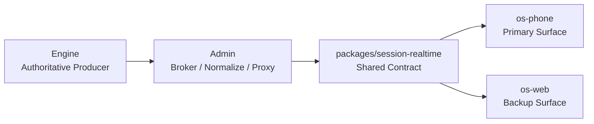

# V8 Agent OS 快速入门（项目级）

适用范围：

- `E:\Projects\v8chat\v8-agent-os`
- `E:\Projects\v8chat\v8-agent-os-site`
- `E:\Projects\v8chat\openclaw-v8-bridge`

这份文档面向第一次接触 V8 Agent OS 的开发者、测试者与运维同学。目标不是讲清全部细节，而是帮助你在最短时间内建立正确心智模型，并把整套系统冷启动起来。

---

## 1. 先记住当前项目角色

V8 Agent OS 现在不是“单仓聊天应用”，而是一套 runtime-first 的多仓系统：

1. `v8-agent-os`
   - 主产品仓
   - 包含 `engine / admin / phone / web / packages`
2. `v8-agent-os-site`
   - 对外站点、安装入口、公开叙事
3. `openclaw-v8-bridge`
   - OpenClaw / `plugin_host` / channels / handoff 桥接主链

当前产品角色固定为：

- `os-phone`：主远端交互面，也是主验收面
- `os-web`：备用 surface，用于桌面回归、调试、排障
- `admin`：控制与观测中心
- `engine`：唯一 authoritative runtime producer

不要再把 `os-web` 当成唯一主用户面，也不要把 `site` 或 `bridge` 看成附属仓。

---

## 2. 一条主链先建立起来

系统当前的核心真相链是：



如果你在排查任何“显示不一致 / 历史漂移 / artifact 链接不对 / ask_user 行为异常 / runtime HUD 问题”，都应该按这条链反查，而不是从页面局部状态开始猜。

---

## 3. 运行前准备

建议准备以下环境：

1. Python 虚拟环境与依赖
2. Node.js / pnpm 或 npm
3. SQLite 可读写环境
4. Expo / Android 模拟器或真机（如果要验证 `os-phone`）

如果你在 Windows 上工作，优先使用仓库自带的启动脚本，而不是手工逐个服务启动。

---

## 4. 最小启动顺序

### 4.1 启动主仓

在 `E:\Projects\v8chat\v8-agent-os` 下优先使用仓库脚本：

```powershell
powershell -ExecutionPolicy Bypass -File .\bootstrap.ps1
```

如果只做局部开发，也可以分别启动：

1. `apps/v8-agent-os-engine`
2. `apps/v8-agent-os-admin`
3. `apps/v8-agent-os-phone` 或 `apps/v8-agent-os-web`

但请记住：功能验证的主面应该优先落在 `os-phone`。

### 4.2 打开 Admin

默认控制面入口：

- `http://127.0.0.1:9528`

首次启动后，先在 Admin 中检查：

1. `models`
2. `workspace`
3. `memory`
4. `supervisor`
5. `systemBase`
6. `runtimeRegistry`

### 4.3 再启动 Phone / Web

- `os-phone`：主远端 surface，优先用 Expo Go / dev client / 真机验证
- `os-web`：备用 surface，只用于桌面调试与回归验证

---

## 5. 当前配置真相在哪里

当前主配置真相是：

- `~/.v8-agent-os/config.json`

最常用的配置域：

- `models`
- `mcp`
- `memory`
- `supervisor`
- `workspace`
- `projects`
- `safety`
- `audio`
- `runtimeRegistry`
- `systemBase`
- `extensions`
- `computerUse`

仍然可能独立存在的关键文件：

- `~/.v8-agent-os/users.json`
- `~/.v8-agent-os/V8_AGENT_OS.md`
- `~/.v8-agent-os/state.db`
- `~/.v8-agent-os/checkpoints.db`
- `~/.v8-agent-os/plugin.json`
- `~/.v8-agent-os/computer_use.json`
- `~/.v8-agent-os/network_supervisor_secrets.json`
- `~/.v8-agent-os/network_supervisor_state.json`

`~/.v8chat` 现在只应视为迁移残留或排障线索，不能继续当配置真相源。

---

## 6. 新人最容易踩坑的 6 件事

1. 不要把 `os-web` 误当成主验收面。
2. 不要让 `web/phone` 直连 `engine`；它们应只依赖 `admin` broker。
3. 不要绕过 `packages/session-realtime` 自己发明一套 snapshot/history/realtime contract。
4. 不要从旧 JSON 或缓存文件推断当前配置是否生效。
5. 不要把 `plugin_host`、`network_supervisor`、`desktop-live` 当成边缘功能。
6. 不要把历史兼容壳说成当前真相源。

---

## 7. 继续读哪几份文档

如果你已经完成冷启动，建议按下面顺序继续：

1. [V8 Agent OS 开发者指南](./V8_AGENT_OS_DEVELOPER_GUIDE_ZH.md)
2. [V8 Agent OS API 参考](./V8_AGENT_OS_API_REFERENCE_ZH.md)
3. [V8 Agent OS 配置指南](./V8_AGENT_OS_CONFIG_GUIDE_ZH.md)
4. `docs/Govern/*` 里的治理与架构升级文档

如果你要改 OpenClaw / plugin host / channels / handoff，请同时联查：

- `E:\Projects\v8chat\openclaw-v8-bridge`
- `E:\Projects\v8chat\v8-agent-os\apps\v8-agent-os-engine\core\plugin_host`

