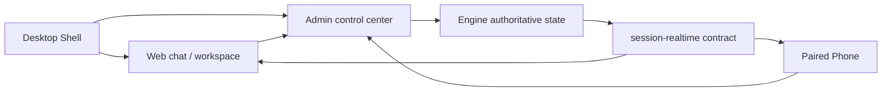

# V8 Agent OS 快速入门

本文面向第一次安装、从源码启动或参与联调的开发者与测试者。内容以当前 `main` 分支和公开 Preview 通道为准。

## 1. 先建立正确的产品心智

V8 Agent OS 当前是桌面优先、本地优先的 Agent 工作空间：

- Desktop：主产品面，由 Engine、Admin、Web、Electron Shell 和受控桌宠组成。
- Web：桌面壳中的主聊天与任务工作区，也是浏览器可访问的本机交互面。
- Admin：模型、工作区、记忆、插件、运行治理和系统配置中心，同时为客户端代理 Engine API。
- Engine：会话、运行、事件、产物、审批和恢复状态的权威生产者。
- Phone：唯一远程交互面，需要配对；用于远程续接任务、回答问题、发送语音或文件和查看产物。
- `packages/session-realtime`：Web、Phone 与 Admin 共用的实时/历史投影契约。

Phone 不是桌面版的替代品，Web 也不是调试备用页。桌面 Web 是当前主交互面，Phone 是配对后的远程延伸。



## 2. 选择一种启动方式

### 2.1 下载 Windows 桌面预览版

普通试用优先前往 [GitHub Releases](https://github.com/justForever17/v8-agent-os/releases) 下载 `v8-os-desktop-v*` 的 Windows Preview 资产。

当前桌面版仍是 unsigned preview：Windows 可能显示安全确认；签名、自动更新和 stable 通道尚未完成。Android Phone Preview 使用 `v8-os-phone-v*` 标签发布。

### 2.2 从源码启动完整桌面预览

Windows 源码预览需要：

- Git
- Python 3.11 或更高版本
- Node.js 20 或更高版本

首次克隆后，在仓库根目录准备 desktop profile 依赖：

```powershell
$env:V8_AGENT_OS_BOOTSTRAP_INSTALL_ONLY = "1"
powershell -ExecutionPolicy Bypass -File .\bootstrap.ps1 --profile desktop --services engine+admin+web
Remove-Item Env:V8_AGENT_OS_BOOTSTRAP_INSTALL_ONLY
```

然后启动完整桌面预览：

```powershell
.\v8os.cmd preview --rebuild
```

`preview --rebuild` 会：

1. 停止由当前源码树拥有的 Shell、Admin、Web 和 Engine 预览进程；
2. 构建原生 sandbox helper；
3. 生产构建 Admin 与 Web；
4. 启动 Engine、Admin、Web 和 Electron Shell。

它不是安装器、系统服务或自动更新入口。

### 2.3 只启动服务

需要浏览器联调而不需要 Electron Shell 时：

```powershell
.\v8os.cmd start
```

默认服务是：

| 服务 | 地址 |
| --- | --- |
| Engine | `http://127.0.0.1:9530` |
| Admin | `http://127.0.0.1:9528` |
| Web | `http://127.0.0.1:9527` |

仓库根目录的裸 `bootstrap.ps1` / `bootstrap.sh` 默认是 Engine + Admin 的依赖安装与服务启动脚本，不等于完整桌面 Shell。Windows 如需同时启动 Web，显式使用 `--services engine+admin+web`；Linux/macOS 当前 bootstrap 只支持 Engine 或 Engine + Admin。

## 3. 首次启动后的最短路径

### 3.1 检查服务

```powershell
.\v8os.cmd status --json
.\v8os.cmd doctor --json
```

`status` 说明进程和端口状态；`doctor` 检查安装、配置与关键依赖。二者是诊断入口，不代替真实桌面操作验收。

### 3.2 配置模型

进入 Admin 的模型中心，添加实际可用的供应商 endpoint 与模型。内置供应商/模型 JSON 是快捷填写目录，不会覆盖用户已经保存的真实配置。

模型身份由“供应商 endpoint + API 通道 + 模型 ID + capability”共同决定。不要只根据显示名推断底层协议。

### 3.3 绑定并信任工作区

在 Web 创建新任务时选择真实项目目录。会话绑定与工作区信任决定 Agent 能读取或修改哪里；页面标签只是展示名，底层仍以规范化路径和项目绑定为准。

现有非 Git 项目在首次使用托管并行写入前需要显式采用。V8OS 不会静默替换分支或替用户提交。

### 3.4 选择主理人工作模式

- 日常模式：适合问答、小改动和短任务；主理人仍可直接使用通用文件与命令工具。
- 编程模式：适合长期项目实施。主理人可以直接动工，也可以按需使用 Engineering episode 或子 Agent 做隔离并行、恢复和独立验证。

Engineering Kernel 会在任务起步时提供绑定工作区、OS、shell dialect 和执行姿态，不需要 Agent 再调用工具重复寻找工作区。

### 3.5 可选：配对 Phone

Phone 通过 Admin 生成的一次性二维码配对。配对成功后保存本地 server profile；短暂网络故障不应清空已有配置。

Web、Shell、桌宠和 CLI 是本机可信入口，不使用 Phone 配对票据，也不会写入“已配对设备”列表。Network Supervisor 是高级多设备协作能力，不属于普通 Phone 配对流程。

## 4. 执行、产物和插件边界

### 4.1 工程执行

有写入权限的委派任务必须带 Engineering Task Capsule，至少明确读写范围、期望输出和验收。子/孙 Agent 没有 Capsule 时是只读姿态；孙 Agent 默认做终止型独立验证，只有显式且严格更小的父写集子集才能写入。

托管 worktree 用于隔离候选变更；只有通过验证的 Supervisor 交付才应用回原工作区。当前 sandbox 是部分强制执行，不是内核级文件系统或离线网络隔离。

### 4.2 来源与产物

- 用户上传：记录为会话 source，在用户消息里展示，不重复算作 Agent 产物。
- Agent 写入、下载、Spec 和创意媒体输出：带 session/run/tool lineage 的 artifact。
- 工作区已有或手工复制的文件：不会自动成为本轮 artifact；需要时必须显式采用。

### 4.3 插件

`@插件` 是强提示，不是唯一授权入口。Supervisor 可以查看已安装插件的轻量可用性提示，并为当前 run 创建最小 task grant；提示本身不加载 Skill 正文、MCP schema 或 CLI action，也不代表已经授权或调用。

直接子 Agent 只能获得父级明确授予的组件子集，并且最多再向一层孙 Agent 传递更小子集。上机发现是只读的，不会接管用户维护的普通 MCP；`plugin_cli` 只有在有效授权投影受审命令后才出现。

## 5. 配置真相

主结构化配置：

- `~/.v8-agent-os/config.json`

独立真相面：

- `~/.v8-agent-os/mcp.json`
- `~/.v8-agent-os/users.json`
- `~/.v8-agent-os/V8_AGENT_OS.md`
- `~/.v8-agent-os/state.db`
- `~/.v8-agent-os/checkpoints.db`
- `~/.v8-agent-os/computer_use.json`
- Network Supervisor 的独立 secret/state 文件
- 操作系统安全凭据存储中的密钥引用

`~/.v8chat` 只作为迁移输入或历史排障线索，不是当前配置真相。不要寻找不存在的 `plugin.json`；Plugin Manager 的策略配置位于 `config.json#pluginManager`，事务与授权状态在数据库中。

## 6. 常用命令

```powershell
.\v8os.cmd preview --rebuild
.\v8os.cmd start
.\v8os.cmd stop
.\v8os.cmd restart
.\v8os.cmd status --json
.\v8os.cmd doctor --json
.\v8os.cmd workspace
```

命令帮助以本机当前源码为准：

```powershell
.\v8os.cmd --help
.\v8os.cmd preview --help
```

## 7. 继续阅读

1. [配置指南](./V8_AGENT_OS_CONFIG_GUIDE_ZH.md)
2. [API 参考](./V8_AGENT_OS_API_REFERENCE_ZH.md)
3. [开发者指南](./V8_AGENT_OS_DEVELOPER_GUIDE_ZH.md)
4. [Engine 测试地图](../apps/v8-agent-os-engine/tests/README.md)

涉及真实 provider、联网调研、媒体生成或高成本评测的测试必须显式启用 live harness；默认测试不应消耗外部额度。
