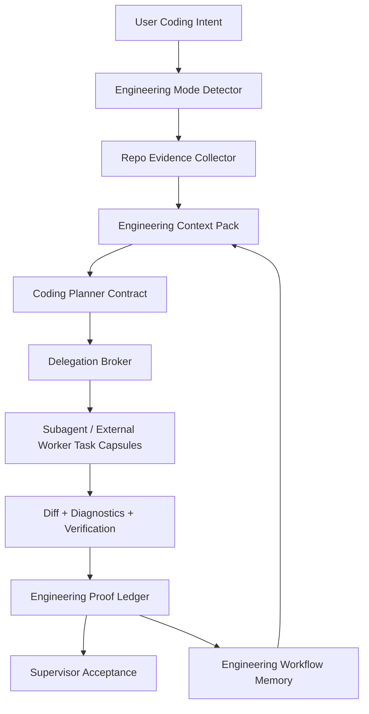

# V8OS Engineering Lane / Code Runtime 深化蓝图

> 目标：让 V8OS 在大项目编码上吸收 Claude Code / IDE 的工程闭环原语，但不做拙劣复制。  
> 路线：**Hybrid Overlay**。第一阶段不另起完整 runtime，而是在现有 `planner_lane + delegation_broker + subagent_swarm + memory workflow` 之上叠加工程专用 profile、上下文胶囊、证明账本和写集治理；接口按未来可独立 `engineering_lane` 预留。

## 1. 核心结论

V8OS 当前已经不像普通聊天产品：它有 runtime 编排、Planner Lane、Delegation Broker、subagent swarm、extensions 预筛、memory workflow、workspace scope、Network Supervisor 和多 surface 投影。它的底座不是弱，而是还没有把这些能力收成一条“面向大项目编码”的窄而硬的工程主链。

Claude Code / IDE 写大项目好用，不是因为它们有神秘提示词，而是因为它们围绕代码工程建立了几个非常朴素但很硬的原语：

- 先读后写
- 计划和执行分离
- 文件、diff、diagnostics 是一等真相
- 修改必须能被验证
- 多 agent 协作必须有 ownership 和回收机制
- 上下文必须被压缩成任务相关证据，而不是全仓灌入

V8OS 要超越它们，不应复制 CLI 或 IDE 外壳，而应把这些原语升级为 OS 级治理能力：**repo evidence graph、Engineering Context Pack、Proof Ledger、Write-set Governor、Diagnostics Ledger、Engineering Workflow Memory**。

一句话：**Claude Code 是垫脚石，不是目标形态。V8OS 的上限来自 runtime evidence + memory workflow + scope 隔离 + 多 agent 治理，而不是更长的 system prompt。**

## 2. 不是复制 Claude Code：三条底线

### 当前建议

Engineering Lane 的第一阶段采用 Hybrid Overlay：

- 复用现有 `planner_lane`
- 复用现有 `delegation_broker`
- 复用现有 `subagent_swarm`
- 复用现有 memory workflow
- 新增工程专用 evidence / capsule / ledger / lock
- 未来如果证据链稳定，再升级为独立 `engineering_lane` runtime card

### 明确不做

- 不把 V8OS 改成 Claude Code clone
- 不把代码能力继续塞进 `V8_AGENT_OS.md` 长提示词
- 不把整仓上下文灌给 supervisor 或 subagent
- 不让 subagent 自由共享全仓写权限
- 不用 `plan/todos` 取代工程证明
- 不把 Phone/Web 做成完整 IDE
- 不让 memory workflow 自动驱动高风险代码修改

### 为什么不能只写更强 prompt

大项目编码失败通常不是模型“不知道要认真”，而是系统没有提供足够硬的事实面：

- 它不知道自己读过哪些文件
- 它不知道哪些文件是用户改的
- 它不知道哪些 diagnostics 仍未修复
- 它不知道 subagent 是否越过了写集
- 它不知道“完成”有没有验证证据

这些不能靠口号解决，必须进入 runtime ledger。

## 3. Claude Code 源码给出的可借鉴原语

本节只吸收机制，不移植产品形态。观察来源包括本地 `E:\Projects\v8chat\Claude\src` 下的 Plan、LSP、File tools、teammate mailbox、context compact 等模块。

### 3.1 只读规划 agent

`tools/AgentTool/built-in/planAgent.ts` 定义了只读规划专家。它禁止 Edit / Write / NotebookEdit / Agent / ExitPlanMode，只允许搜索、读取和只读 shell 操作，最后要求输出 critical files。

可借鉴点：

- 规划阶段必须只读
- Planner 输出必须包含关键文件
- Planner 不应直接执行重操作
- 工具面降噪比“更聪明的系统提示词”更重要

V8OS 超越点：

- 不止输出 critical files，还要输出 `readSet / writeSet / verificationMatrix / mergeOrder`
- 不止给用户看计划，还要成为 `delegation_broker` 的结构化上游
- 不止保护文件写入，还要保护 runtime side effects

### 3.2 Plan 文件是持久工程工件

`utils/plans.ts` 为主会话和 subagent 维护 plan 文件，支持 resume、fork、snapshot recovery。关键不是“保存一个 md”，而是 plan 从聊天文本变成可恢复工件。

可借鉴点：

- plan 不应只存在于模型上下文
- subagent 可以有独立 plan
- resume 时需要恢复计划真相

V8OS 超越点：

- V8OS 已有 `planner_lane` 和 runtime snapshot，应把 plan 变成 runtime projection + workflow ledger，而不是只落文件
- 工程 plan 应绑定 proof ledger，计划和验证互相引用

### 3.3 File state 与 edit validation

Claude Code 的 Read/Edit/Write 工具围绕 `readFileState` 做了大量校验。模型不是想改就改，至少要有“读过文件”的状态基础。

可借鉴点：

- 读文件状态需要被跟踪
- 编辑前后要知道文件是否变化
- stale read 是真实风险

V8OS 超越点：

- read-state 应升级为 `readSet`，不仅记录读过，还记录读的目的、片段、mtime/hash 和 task 归属
- write-state 应升级为 `writeSet` + `EngineeringWorksetLock`
- 用户已有修改必须被标成 protected input，不能被 subagent 覆盖

### 3.4 LSP / diagnostics 是工程闭环的一等输入

`tools/LSPTool/*`、context usage、diagnostics 相关逻辑说明 Claude Code 正在把 IDE 级问题面纳入 agent loop。

可借鉴点：

- diagnostics 不能只在终端文本里
- 符号和 LSP 能降低盲搜成本
- 验证失败需要结构化归因

V8OS 超越点：

- V8OS 应建立 `Diagnostics Ledger`，把 LSP/typecheck/test/build/log 都归入 task、file、agent、verification contract
- diagnostics 应驱动 planner repair 和 broker retry，而不是只作为聊天总结

### 3.5 Teammate mailbox 是 swarm 治理雏形

`utils/teammateMailbox.ts` 提供 inbox、锁、permission request、plan approval、idle notification、shutdown 等结构化消息。它证明 swarm 不是“并发调用模型”这么简单，而是消息、权限、状态和回收机制。

可借鉴点：

- 子代理需要异步消息回收
- 权限请求和计划审批要有结构
- idle / failed / completed 状态要可观测

V8OS 超越点：

- V8OS 已有 `subagent_swarm` runtime card，应把 mailbox 类语义升级成 `taskBriefId + writeSet + proofLedger + supervisorAcceptance`
- 不需要复制 file inbox，可以用 runtime events / workflow ledger 做更强的一致性真相

### 3.6 Microcompact / context usage 证明 token 是工程资源

Claude Code 的 microcompact、context usage、readFileState cache 都在说明一个现实：大项目编码里 token 是工程资源，不是越多越好。

可借鉴点：

- 上下文需要预算、清理、复用
- 工具结果不能无限留在上下文
- 用户需要知道上下文用在哪里

V8OS 超越点：

- V8OS 应把 token 预算从“聊天上下文压缩”升级为 `Engineering Context Pack` 的分层预算
- Repo Brief、Task Capsule、Diagnostics Digest、Proof Summary、Workflow Hint 各自有预算和截断诊断

## 4. V8OS 当前优势：不是弱，而是缺工程收束

V8OS 已经拥有 Claude Code 不具备或不作为主线的能力：

- `planner_lane`：结构化规划、quality gate、runtime card
- `delegation_broker`：本地 subagent 与 external worker 的统一入口
- `subagent_swarm`：子任务中间态独立投影，不污染 supervisor 气泡
- `capabilitySnapshot`：subagent 选择有能力画像，不靠展示身份
- extensions 预筛：Skills / MCP / PluginHost 能按 task truth 动态暴露
- memory workflow：行为链可验证、可清洗、可渐进注入
- workspace scope：默认工作区与项目工作区正在收成单选真相
- Network Supervisor：OpenAI compat 支线和专用 memory adapter 已成形
- Runtime governance：比 IDE 更重视恢复、审计、诊断和多 surface 一致性

因此 Engineering Lane 不应“推翻重做”，而应把这些能力重新组织成工程闭环。

## 5. 当前真正缺口与可能爆雷点

### 5.1 Repo intelligence 缺位

当前主要依赖 `grep_search / read_native_file / run_system_command` 临时拼图。大项目需要 repo evidence graph：

- 文件图
- 符号图
- 依赖图
- 变更图
- 测试图
- diagnostics 图
- runtime surface 归属图

爆雷方式：

- planner 输出漂亮但泛
- subagent 重复读同一批文件
- 修改影响面判断错误
- 测试命令选错

### 5.2 Read-set / write-set 仍偏文本字段

现有 task brief 有 `writeSet`，但还不是 runtime 强约束。

爆雷方式：

- 两个 subagent 同时改同一文件
- subagent 覆盖用户改动
- reviewer 不知道实现者读过哪些关键文件
- supervisor 无法判断“这次改动是否越界”

### 5.3 Diff-first 闭环不够硬

V8OS 能写文件，但大项目需要 diff 作为验收单位。

爆雷方式：

- 交付总结说改了，实际 diff 不匹配
- 改动没有绑定 task brief
- review 重新读全仓，token 爆炸
- rollback 无法定位

### 5.4 Diagnostics-first 不够强

验证结果仍容易散落在命令输出、runtime card 或文字总结里。

爆雷方式：

- “测试通过”没有可追溯命令
- build error 被摘要吞掉
- LSP/typecheck 问题没有归属到文件和 task
- 后续 agent 重复修同一个问题

### 5.5 泛 planner 不等于 coding planner

当前 planner 能拆任务，但大项目编码需要工程专用 contract。

爆雷方式：

- task brief 太抽象
- 只分功能，不分文件 ownership
- 无 verification matrix
- 无 merge order

### 5.6 Subagent swarm 缺工程 ownership

现在已经能展示 swarm，但 coding swarm 需要更严格的职责边界。

爆雷方式：

- implementer、reviewer、verifier 都去改代码
- 文档 agent 顺手改核心逻辑
- external worker 与 local subagent 互相覆盖
- supervisor 最终只能人工猜谁是对的

### 5.7 Memory workflow 可能误学工程流程

行为链记忆很强，但编码流程里失败绕路很多。

爆雷方式：

- 一次失败修复被学成默认流程
- 项目 A 的构建习惯流入项目 B
- 高风险写文件链被自动提示
- workflow hint 覆盖 planner 计划

### 5.8 Token 精打细算还没有工程分账

当前 prompt budget 已有基础，但 Engineering Lane 需要按上下文类型分账。

爆雷方式：

- repo map 太长
- diagnostics 全量灌入
- proof history 无限增长
- subagent task capsule 混入 supervisor 全局上下文

## 6. 目标架构：Hybrid Overlay Engineering Lane

Engineering Lane 第一阶段不是独立 runtime，而是一个覆盖在现有 chat runtime 上的工程 profile。

### 6.1 Engineering Mode Detector

触发条件建议：

- 用户请求明确涉及代码修改、debug、refactor、测试、CI、构建、迁移
- 当前 workspace 绑定到 repo
- planner 判断任务存在多文件/多阶段/验证需求
- memory workflow 命中仓库级工程链路

不触发条件：

- 纯问答
- 单文件小文案
- 非代码 runtime 操作
- 无 workspace binding 且无法建立 repo evidence

### 6.2 Engineering Context Pack

`EngineeringContextPack` 是 Engineering Lane 的核心 token 管理单元。它不是全仓摘要，而是任务相关证据包。

建议字段：

- `repoBrief`
- `workspaceRulesDigest`
- `criticalFiles`
- `recentChanges`
- `diagnosticsSlice`
- `testCommandMap`
- `knownWorkflowHints`
- `protectedUserChanges`
- `budgetDiagnostics`

默认预算建议：

| 分区 | 默认上限 | 说明 |
|---|---:|---|
| Repo Brief | 1500 estimated tokens | 只给目录、入口、语言、包管理、关键模块 |
| Task Capsule | 3000 estimated tokens | 给 planner/subagent 的任务上下文 |
| Diagnostics Digest | 1200 estimated tokens | 聚合当前相关 diagnostics，不放全量日志 |
| Proof Summary | 1000 estimated tokens | 给 supervisor 验收用 |
| Workflow Hint | 500 estimated tokens | 只给下一步 checklist/bias |

超预算策略：

- 截断必须有 diagnostics
- 优先保留 critical files 和 verification contract
- 不因预算不足回退为全仓灌入

### 6.3 Coding Planner Contract

`CodingPlannerContract` 是 `planner_lane` 在工程任务下的专用输出。

建议字段：

- `engineeringPlanId`
- `goal`
- `criticalFiles`
- `readSet`
- `writeSet`
- `protectedFiles`
- `subagentSlices`
- `verificationMatrix`
- `diagnosticsToResolve`
- `mergeOrder`
- `rollbackPlan`
- `riskFlags`

关键纪律：

- planner 默认只读
- planner 不直接改文件
- `executionStrategy=direct/delegate/mixed` 必须解释原因
- 没有 `verificationMatrix` 的计划不能进入自动派发

### 6.4 Engineering Task Capsule

`EngineeringTaskCapsule` 是派给 subagent 的最小工程上下文。

建议字段：

- `taskBriefId`
- `goal`
- `readSet`
- `writeSet`
- `behaviorScope`
- `criticalFiles`
- `contextDigest`
- `verificationContract`
- `allowedToolsProfile`
- `handoffExpectation`
- `proofRequired`

关键纪律：

- subagent 不接收完整 supervisor plan graph
- subagent 不接收全仓 context
- subagent 不接收其他 slice 的写权限
- reviewer/verifier 默认只读

### 6.5 Engineering Workset Lock

`EngineeringWorksetLock` 用于防止并发写集互踩。

建议行为：

- 同一文件同一时间只能有一个 writable owner
- 目录级 lock 可用于重构任务
- read-only reviewer 可以读取被锁文件，但不能写
- 冲突时 broker 不自动合并，交给 supervisor 或重新切片
- 用户已有修改默认是 protected lock

### 6.6 Engineering Proof Ledger

`EngineeringProofLedgerEntry` 是“完成”的真相，而不是 agent 总结。

建议字段：

- `entryId`
- `taskBriefId`
- `actorId`
- `patchIntent`
- `readSetObserved`
- `writeSetTouched`
- `diffSummary`
- `commandsRun`
- `diagnosticsBefore`
- `diagnosticsAfter`
- `testResults`
- `residualRisks`
- `supervisorAcceptance`

验收原则：

- 没有 proof ledger，不称为 verified
- 跑不了测试要写清原因
- diagnostics 未清零要进入 residual risks
- supervisor 最终采纳引用 ledger，而不是引用 subagent 自评

### 6.7 Diagnostics Ledger

Diagnostics Ledger 汇总：

- LSP diagnostics
- typecheck
- lint
- unit/integration tests
- build
- runtime logs
- command exit code

每条 diagnostics 应绑定：

- file / line / symbol
- taskBriefId
- actorId
- firstSeen / lastSeen
- status: open / fixed / ignored / residual

### 6.8 Engineering Workflow Memory

Engineering workflow memory 只从 evidence 中学习，不从聊天文本臆测。

可以学习：

- 本仓常用验证顺序
- 某类错误的稳定修复链
- 构建/测试 anti-pattern
- 用户反复强调的工程偏好
- errorful-success 清洗后的 golden path

不能学习：

- 单次失败绕路
- 没有验证的修复
- 跨项目路径细节
- 高风险写文件/安装/迁移流程的自动执行

注入方式：

- 默认 checklist/bias
- 有 planner 时降级为 planner-aware checklist
- 只给下一步或验证提醒
- 不覆盖 `CodingPlannerContract`

## 7. 工程 subagent 班子建议

默认班子不是越多越好，而是角色边界要硬。

### 7.1 Engineering Planner

- 只读
- 输出 critical files、readSet、writeSet、verificationMatrix
- 不执行修改

### 7.2 Implementation Engineer

- 只写被分配 writeSet
- 每次提交 patch intent 和 diff summary
- 必须给验证建议

### 7.3 Verification Engineer

- 默认只读
- 复现、运行测试、解释 diagnostics
- 不直接改实现，除非 supervisor 明确授权

### 7.4 Code Review Architect

- 只看 contract、diff、proof ledger、关键上下文
- 输出风险、遗漏、回归点
- 不重写实现

### 7.5 Docs / Delivery Writer

- 整理变更说明、迁移说明、交付文档
- 不改核心代码

### 7.6 Research / Integration Scout

- 查 API / 文档 / 外部资料
- 输出引用和约束
- 不写仓库代码

## 8. Surface 设计：不复制 IDE，但要有工程真相面

### Admin Engineering Workbench

Admin 是治理面，应承接完整工程状态：

- Engineering plan
- critical files
- active write-set locks
- changed files
- diagnostics ledger
- proof ledger
- verification matrix
- subagent ownership map
- memory workflow hints

### Phone / Web

Phone/Web 不做完整 IDE，只显示 compact status：

- 当前工程任务
- 已完成 / 阻塞 / 验证中
- 关键风险
- 需要用户确认的决策
- 最终 proof summary

### Runtime Cards

第一阶段可复用现有：

- `planner_lane` 展示 coding planner summary
- `subagent_swarm` 展示工程 slice 执行
- `context_governance` 展示 token / scope / diagnostics 治理摘要

未来若 Engineering Lane 证据稳定，再考虑新增独立 `engineering_lane` card。

## 9. 与现有 V8OS 模块的关系

### 与 Planner Lane

Engineering Lane 不替代 planner，而是给 planner 增加 coding profile。

### 与 Delegation Broker

Broker 仍是唯一委派入口，但在 engineering mode 下必须读取 workset locks 和 capabilitySnapshot。

### 与 Extensions

Extensions 仍按 task capsule 预筛。工程任务不应自动暴露全量 Skills/MCP/PluginHost。

### 与 Memory Workflow

Memory workflow 只给 checklist/bias，不能替代 proof ledger。

### 与 Workspace Scope

EngineeringContextPack 必须尊重单 workspace truth：

- 默认工作区只看默认工作区 rules/skills
- 项目工作区只看当前项目 rules/skills
- 不跨 workspace 合并 repo evidence

### 与 Network Supervisor

OpenAI compat 支线可使用 Engineering Lane，但外部 wire 不暴露内部 planner/subagent/proof 细节。对外只返回标准 assistant/tool_call 结果。

## 10. 分阶段落地路线

### Phase 0：文档与接口冻结

目标：

- 冻结 Hybrid Overlay 路线
- 定义 EngineeringContextPack / TaskCapsule / ProofLedger / WorksetLock
- 明确非目标

验收：

- 报告能直接指导实现
- 不再把“更强 prompt”当主方案

### Phase 1：只读 EngineeringContextPack dry-run

目标：

- 不改执行链
- 为一个真实 repo task 导出 context pack
- 验证 token 预算、scope、rules、repo brief、diagnostics slice

验收：

- 无全仓灌入
- 无跨 workspace 串入
- 预算诊断可解释

### Phase 2：Proof Ledger MVP

目标：

- 捕获 git diff、changed files、command results、diagnostics
- 绑定到 taskBriefId

验收：

- 改了代码但未验证时不能显示 verified
- 测试失败能归属到文件和 task

### Phase 3：Coding Planner Contract

目标：

- planner 输出 criticalFiles/readSet/writeSet/verificationMatrix
- direct/delegate/mixed 都有工程解释

验收：

- 多文件任务不再只给泛 task brief
- `verificationMatrix` 缺失时阻断自动派发

### Phase 4：Code-aware Delegation Broker

目标：

- 按 capabilitySnapshot + writeSet 分派
- reviewer/verifier 默认只读
- write-set 冲突阻断

验收：

- 两个 subagent 写同一文件会被阻断或要求重新切片
- preferredAgentId 不绕过 write-set lock

### Phase 5：Admin Engineering Workbench

目标：

- 展示 plan、locks、diff、diagnostics、proof、ownership
- Phone/Web 只显示 compact status

验收：

- 用户不看聊天文本也能判断工程状态

### Phase 6：Engineering Workflow Memory

目标：

- 从 proof ledger 提炼重复工程链路
- 渐进 checklist/bias 注入

验收：

- 成功链路有证据
- 失败绕路进入 anti-pattern
- 高风险流程不自动 active

## 11. 测试与验收矩阵

### Context Pack

- 导出真实大项目任务 context pack
- 确认没有全仓灌入
- 确认 budget diagnostics 存在
- 确认项目 A 不读取项目 B rules/skills/memory

### Planner

- 多文件任务输出 criticalFiles/readSet/writeSet
- 缺 verificationMatrix 时不自动 dispatch
- direct 任务不误触发 broker

### Workset

- 两个 subagent 同写一文件被阻断
- reviewer/verifier 只读
- 用户已有修改被 protected

### Proof

- 修改代码但未跑测试不能标 verified
- 测试失败进入 diagnostics ledger
- residual risks 出现在 supervisor final acceptance

### Memory

- 重复修复链路只注入下一步 checklist
- contradicted / caused_failure 会抑制或隔离 workflow
- 有 planner 时 workflow hint 降级为 checklist/bias

### Surface

- Admin 能看到工程真相
- Phone/Web 不被完整 IDE 化
- planner/subagent 内部原文不污染 supervisor 气泡

## 12. 关键风险与预防

### 风险：Engineering Lane 变成又一套大 runtime

预防：

- 第一阶段 Hybrid Overlay
- 先做 evidence / ledger
- 不先做复杂 UI

### 风险：token 预算被 repo index 吃爆

预防：

- Repo Brief 与 Task Capsule 分账
- diagnostics 只取相关 slice
- proof history 只给 summary

### 风险：subagent 并发写坏代码

预防：

- write-set lock
- reviewer/verifier 默认只读
- supervisor merge arbitration

### 风险：memory workflow 学坏

预防：

- 只从 proof ledger 学
- 需要验证证据
- errorful-success 做 golden path 清洗

### 风险：工程能力污染普通聊天

预防：

- Engineering Mode Detector
- 无 repo/workspace 时不启动
- 只在 coding intent 命中时注入工程上下文

## 13. 结论

V8OS 写大项目真正缺的不是“再写一段更强 system prompt”，而是一组工程级 runtime 原语：

- `EngineeringContextPack`
- `CodingPlannerContract`
- `EngineeringTaskCapsule`
- `EngineeringWorksetLock`
- `DiagnosticsLedger`
- `EngineeringProofLedger`
- `EngineeringWorkflowMemory`

Claude Code / IDE 证明了文件、diff、diagnostics、plan gate、teammate mailbox 这些朴素原语非常有效；V8OS 应该把它们提升为 OS 级治理结构，而不是复制 CLI 外壳。

最克制也最强的路线是：**先做 Hybrid Overlay，把工程事实接进现有 runtime 主链；等 proof ledger 与 workset governance 稳定后，再决定是否提升为独立 Engineering Runtime。**
