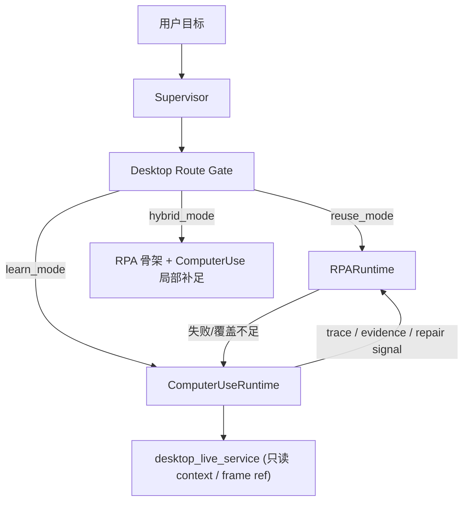

# `supervisor / rpa / computer_use` 职责边界与入口纪律重构建议

## 一、文档定位

这份文档不是能力宣传稿，也不是远期愿景说明，而是一份可直接执行的 runtime 设计稿。

目标只有一个：

> 把 `supervisor`、`rpa`、`computer_use` 三者之间当前“能力上有重叠、入口上不够硬、治理上不够对称”的状态，收成一个不会继续分裂的主链。

本文只基于当前主仓代码事实判断，不按理想形态倒推现状。

核心事实源：

- [computer_use_tool_surface.py](E:/Projects/v8chat/v8-agent-os/apps/v8-agent-os-engine/core/computer_use_tool_surface.py)
- [supervisor_tool_policy.py](E:/Projects/v8chat/v8-agent-os/apps/v8-agent-os-engine/core/supervisor_tool_policy.py)
- [supervisor_builder.py](E:/Projects/v8chat/v8-agent-os/apps/v8-agent-os-engine/graph/supervisor_builder.py)
- [supervisor_routing.py](E:/Projects/v8chat/v8-agent-os/apps/v8-agent-os-engine/graph/supervisor_routing.py)
- [native_tools.py](E:/Projects/v8chat/v8-agent-os/apps/v8-agent-os-engine/core/native_tools.py)
- [computer_use_execution_route.py](E:/Projects/v8chat/v8-agent-os/apps/v8-agent-os-engine/core/computer_use_execution_route.py)
- [capability_registry.py](E:/Projects/v8chat/v8-agent-os/apps/v8-agent-os-engine/erc/capability_registry.py)
- [runtimes/computer_use/runtime.py](E:/Projects/v8chat/v8-agent-os/apps/v8-agent-os-engine/runtimes/computer_use/runtime.py)
- [runtimes/computer_use/primitives.py](E:/Projects/v8chat/v8-agent-os/apps/v8-agent-os-engine/runtimes/computer_use/primitives.py)
- [runtimes/rpa/runtime.py](E:/Projects/v8chat/v8-agent-os/apps/v8-agent-os-engine/runtimes/rpa/runtime.py)
- [runtimes/rpa/template_service.py](E:/Projects/v8chat/v8-agent-os/apps/v8-agent-os-engine/runtimes/rpa/template_service.py)
- [runtimes/rpa/robot_keywords.py](E:/Projects/v8chat/v8-agent-os/apps/v8-agent-os-engine/runtimes/rpa/robot_keywords.py)

---

## 二、执行摘要

当前系统的问题，不是 `supervisor` 与 `computer_use` 都“会操作”这件事本身，而是：

1. `supervisor` 虽然默认只拿到高层 `computer_use_*` 工具，但桌面任务并没有被**硬性要求**先经过 `reuse_mode / hybrid_mode / learn_mode` 路由。
2. `rpa` 与 `computer_use` 的执行联动已经很深，但在工具暴露与治理层仍不对称。
3. 当前主链更像“允许 orchestrator 直接下场挑具体 runtime 工具”，而不是“由统一入口先判定最合适的 runtime，再执行”。

因此本设计稿的总判断是：

- **不应粗暴削掉 supervisor 的高层操作能力。**
- **应硬限制 supervisor 直接绕过 route-first 纪律。**
- **应把 `rpa` 与 `computer_use` 一起提升为受 runtime governance 管理的桌面执行面。**
- **应把 `supervisor` 收成 orchestrator，而不是桌面细节操作者。**

一句话结论：

> 应削的是“未经路由就直接挑具体桌面执行工具的自由度”，不是削 `supervisor` 的主理能力本身。

---

## 三、当前事实诊断

### 3.1 当前不是“双重执行器冲突”，而是“高层 wrapper + runtime 主链”

当前 `supervisor` 并不是直接拿着底层桌面驱动去点屏幕。  
它默认获得的是高层 `computer_use_*` 工具面，比如：

- `computer_use_resolve_execution_route`
- `computer_use_launch_app`
- `computer_use_observe_scene`
- `computer_use_click_target`
- `computer_use_input_text`

见 [computer_use_tool_surface.py](E:/Projects/v8chat/v8-agent-os/apps/v8-agent-os-engine/core/computer_use_tool_surface.py)。

这些工具最终都会回到 [native_tools.py](E:/Projects/v8chat/v8-agent-os/apps/v8-agent-os-engine/core/native_tools.py) 的 wrapper，再进入 [ComputerUseRuntime](E:/Projects/v8chat/v8-agent-os/apps/v8-agent-os-engine/runtimes/computer_use/runtime.py)。

因此，当前系统里不存在一套“supervisor 自己维护的第二套桌面执行器”。  
真正存在的是：

- `supervisor` 负责决策和调度
- `computer_use` 负责桌面执行
- 但入口纪律还不够硬

### 3.2 当前已经做对的部分

当前主链里，已经有三件事方向是对的：

1. **低层 computer_use 工具默认不暴露给 supervisor**
   - 低层 `computer_use_click / computer_use_open_app / computer_use_type_text / ...` 在默认排除面中
   - 高层 `click_target / input_text / observe_scene / launch_app` 留给 supervisor
2. **RPA 已经不是独立于 Computer Use 的另一条世界线**
   - `rpa` 的模板推荐、`computer_use_first`、fallback、repair 都是真实主链
3. **ComputerUseRuntime 已经显式声明是 runtime-managed surface**
   - `managedToolPrefixes=["computer_use_"]`

这些都说明当前不是“方向全错”，而是“还差最后一层纪律收口”。

### 3.3 当前最危险的缺口

当前最危险的缺口只有两个：

1. **route-first 只是建议，不是硬 gate**
   - [computer_use_resolve_execution_route](E:/Projects/v8chat/v8-agent-os/apps/v8-agent-os-engine/core/native_tools.py#L6116) 文案已经写明它是 preferred entrypoint
   - 但 `supervisor` 仍可跳过它，直接选 `computer_use_launch_app / click_target / input_text`
2. **`rpa` 尚未升格成 runtime-managed tool surface**
   - `computer_use` 有 `managedToolPrefixes=["computer_use_"]`
   - `rpa` 当前还是 `managedToolPrefixes=[]`

这两个缺口叠加后，当前系统容易变成：

- route 存在，但不强制
- runtime 联动存在，但治理不对称

---

## 四、目标状态

二次重构后的目标状态固定如下。

### 4.1 `supervisor` 的职责

`supervisor` 只保留这些职责：

1. 理解用户目标与上下文
2. 先判定任务属于：
   - 非 GUI API/工具路径
   - `rpa` 复用路径
   - `computer_use` 学习/混合路径
3. 协调审批、等待、失败恢复、结果汇总
4. 在多 runtime 之间切换，不持有底层桌面原语

`supervisor` 不应继续承担：

1. 直接编排低层桌面原语
2. 直接猜测桌面步骤细节
3. 在 route 未决的情况下自行决定“现在是 RPA 还是 Computer Use”

### 4.2 `rpa` 的职责

`rpa` 的职责固定为：

1. 承接 `reuse_mode`
2. 承接 `hybrid_mode` 中的模板骨架
3. 管理 trace -> draft -> robot -> fallback -> repair 闭环
4. 向 `computer_use` 提供：
   - 模板治理反馈
   - selector memory / patch
   - fallback 来源

`rpa` 不应承担：

1. 自由式桌面探索
2. 作为另一套独立桌面原语执行器长期扩张
3. 在没有 route 结论时直接被 `supervisor` 随手点名执行

### 4.3 `computer_use` 的职责

`computer_use` 的职责固定为：

1. 承接 `learn_mode`
2. 承接 `hybrid_mode` 中模板覆盖不到的局部探索
3. 作为 GUI、浏览器 lane、桌面观察、验证、恢复的统一执行面
4. 为 RPA 提供：
   - 学习来源
   - fallback 执行
   - trace 与修补依据

`computer_use` 不应承担：

1. 自己决定是否应该交给 RPA
2. 绕开 route 直接成为所有桌面任务的默认执行器
3. 反向依赖 `desktop_live_bridge_server` 当观察主源

---

## 五、哪些该硬限制，哪些不该削

## 5.1 必须硬限制的部分

### A. 桌面类任务必须先过 route gate

凡满足下面任一条件的任务，必须先通过统一入口判定 runtime：

1. 涉及桌面 GUI、窗口、浏览器、Electron、文件对话框、系统设置
2. 涉及已知 app 复用、肌肉记忆、模板候选
3. 涉及多步桌面任务，而不是单个显式 API 调用

硬规则：

1. 默认先走 `computer_use_resolve_execution_route`
2. 得到：
   - `reuse_mode` -> 只能优先进入 `rpa`
   - `hybrid_mode` -> 以 `rpa` 骨架 + `computer_use` 补足
   - `learn_mode` -> 才进入 `computer_use` 主执行链

禁止继续允许：

- supervisor 在没有 route 结论的情况下，直接把桌面任务扔给 `computer_use_launch_app/click_target/input_text`

### B. supervisor 默认不可见低层 computer_use 原语

这条当前已经部分成立，但要从“默认排除”升级成“制度性边界”。

应继续保持默认不可直接暴露给 supervisor 的工具：

- `computer_use_click`
- `computer_use_open_app`
- `computer_use_type_text`
- `computer_use_scroll`
- `computer_use_find_element`
- `computer_use_execute_plan`
- 其他低层 direct primitive

这些原语只能：

1. 供 runtime 内部使用
2. 或在明确 override / debug 语境下受控开放

### C. `rpa_*` 也应进入 runtime-managed surface

当前不对称点必须收掉：

- `computer_use` 已是 runtime-managed
- `rpa` 还不是

硬规则建议：

1. `rpa` runtime descriptor 应声明 `managedToolPrefixes=["rpa_"]`
2. capability registry、supervisor tool policy、snapshot 都按 runtime-managed 方式治理它
3. `supervisor` 不再把 `rpa_*` 看成普通 native tools，而应把它看成“通过 route gate 进入的 runtime surface”

### D. Electron / WebView2 不能再把 managed launch 默认当成功

这是桌面 route 纪律的一部分，不只是浏览器 lane 细节。

像 Obsidian 这类场景已经证明：

- managed launch 可能只拉起新壳窗口
- 并不等于接入用户当前工作区/当前会话

硬规则：

1. Electron / WebView2 先 attach existing session/window
2. managed launch 只做 fallback
3. `managed_launch_shell_only` 必须是显式降级状态，不能算成功

## 5.2 明确不该削的部分

### A. 不该削 `supervisor` 的高层 runtime 操作能力

不应删除或过度削弱这些能力：

- `computer_use_resolve_execution_route`
- `computer_use_list_apps`
- `computer_use_desktop_capabilities`
- `computer_use_observe_scene`
- `computer_use_click_target`
- `computer_use_input_text`
- `rpa` 的高层入口

原因很简单：

1. `supervisor` 仍需要 orchestration 能力
2. 它仍需要在 route 之后调度正确 runtime
3. 如果把这些也削掉，`supervisor` 会失去主理能力，变成只能盲目 handoff

### B. 不该把所有桌面任务都强制推给 `computer_use`

这样会直接降级：

1. 已存在模板的 `reuse_mode`
2. 结构化的 `rpa` 主执行链
3. 某些 adapter / browser lane 的高精度入口

因此错误方案是：

> “削减 supervisor 工具范围，让它更主动地去让 computer_use 干活”

更准确的方案应该是：

> “削减 supervisor 绕过 route 的自由度，让它更主动地先走 route，再调合适的 runtime 干活”

### C. 不该把 `desktop-live` 变成桌面动作的入口替身

`desktop-live` 继续只承担：

1. 服务态
2. 帧引用
3. observation context

不应把它升格成：

1. `computer_use` 的观察主链入口 API
2. `computer_use` 的桥接依赖
3. supervisor 的桌面执行面

---

## 六、建议中的目标架构

## 6.1 统一入口图

这张图里唯一需要强调的是：

- `Supervisor` 不直接对底层桌面原语下手
- 它必须先经过 `Desktop Route Gate`

## 6.2 Route Gate 的职责

统一入口层应只做三件事：

1. 判断任务是否属于 desktop-class
2. 调用 route recommendation
3. 返回唯一可执行建议：
   - runtime
   - allowed tool surface
   - degradation reason

它不应做：

1. 桌面动作执行
2. 模板展开
3. 视觉判断

## 6.3 Runtime-managed tool symmetry

目标状态：

- `computer_use_*` 由 `computer_use` runtime managed
- `rpa_*` 由 `rpa` runtime managed
- `supervisor` 只能看到高层 surface
- 低层 surface 只能由 runtime 内部继续向下调用

这样做的价值是：

1. tool exposure 和 runtime boundary 终于一致
2. capability registry 可以真实表达“谁管什么”
3. supervisor policy snapshot 不再一边把 computer_use 当 runtime，一边把 rpa 当普通工具堆

---

## 七、执行规则

## 7.1 桌面类任务硬 gate 规则

默认必须先 route 的任务：

1. app 打开/切换/恢复
2. 浏览器/Electron/WebView2 交互
3. 文件上传/文件对话框
4. 多步表单/列表/设置任务
5. 任何需要“观察 -> 操作 -> 验证”的 GUI 任务

可豁免 route 的少数场景：

1. runtime 内部 continuation
   - 例如已在 `computer_use` run 内部继续下一步
2. adapter 明确声明的 structured open
   - 例如未来的 `vscode` adapter 直接走 `code --goto`
3. 非 GUI API / CLI 场景

## 7.2 `reuse_mode` 执行纪律

命中 `reuse_mode` 后：

1. 默认只允许进入 `rpa`
2. `supervisor` 不应改判为 `computer_use`
3. 只有模板执行失败或局部无法覆盖时，才由 `rpa` 内部触发 `computer_use` fallback

## 7.3 `hybrid_mode` 执行纪律

命中 `hybrid_mode` 后：

1. 默认由 `rpa` 持有骨架
2. `computer_use` 只处理局部探索、补齐、验证和 repair source
3. `supervisor` 不应自己拆分桌面步骤再分别调两个 runtime

## 7.4 `learn_mode` 执行纪律

命中 `learn_mode` 后：

1. 才允许 `computer_use` 成为主执行面
2. 由 `computer_use` 输出 trace / evidence / promotion candidate
3. 后续再由 `rpa` 决定是否固化为模板

---

## 八、RPA 与 ComputerUse 的联动重构建议

## 8.1 当前已真实存在的联动

当前这些联动已经存在，应保留：

1. route recommendation 来自 `rpa.template_service`
2. `computer_use_first` 执行路径存在
3. `rpa` 失败后调用 `computer_use` fallback
4. fallback trace 可以回修 `rpa` 脚本
5. `robot_keywords` 直接桥接 `computer_use_runtime.*`

这说明联动主链不需要推翻。

## 8.2 当前最该补的不是“再深一点执行集成”，而是治理对称性

优先级应是：

1. 先让 `rpa` 成为 runtime-managed surface
2. 再让 route gate 成为硬门
3. 最后才讨论是否进一步统一 action contract

否则会出现一个很别扭的状态：

- 执行上早就深度耦合
- 治理上却仍像两套不平等的工具面

## 8.3 对 `supportsRpaPromotion` 的纪律

[primitives.py](E:/Projects/v8chat/v8-agent-os/apps/v8-agent-os-engine/runtimes/computer_use/primitives.py) 已经区分了哪些动作适合 promotion。这个方向不应倒退。

建议保留纪律：

1. `observe / screenshot / wait` 这类只提供上下文的动作不应被轻易模板化
2. 只有高价值、可复用、可验证的动作才 promotion
3. promotion gate 继续作为 `computer_use -> rpa` 的收敛阀门

---

## 九、分阶段落地建议

## 9.1 第一阶段：治理对称化

目标：

1. `rpa` 进入 runtime-managed surface
2. supervisor policy snapshot 中对 `rpa` 与 `computer_use` 一视同仁
3. 低层桌面原语继续只保留在 runtime 内部

交付标志：

1. capability registry 能识别 `rpa_*`
2. supervisor tool policy snapshot 中能看到 `rpa` 的 runtime-managed 条目
3. 默认 supervisor 工具面不再把 `rpa_*` 混成普通 native tools

## 9.2 第二阶段：硬 route gate

目标：

1. desktop-class 任务默认先 route
2. supervisor 不能轻易绕过 route 直接下具体 runtime 工具
3. 允许极少数 continuation / adapter 豁免

交付标志：

1. `reuse_mode` 任务不再被 supervisor 直接扔给 `computer_use`
2. `hybrid_mode` 任务以 `rpa` 骨架为主，而不是 supervisor 自己拆分
3. `learn_mode` 才进入 `computer_use` 主执行

## 9.3 第三阶段：桌面任务说明性输出统一

目标：

让 compact response / diagnostics / trace 一眼看清：

1. 这次任务为什么选了这个 runtime
2. 是否是 route-driven
3. 是否发生 fallback
4. fallback 是谁触发的

建议输出字段：

- `routeGateApplied`
- `recommendedMode`
- `chosenRuntime`
- `runtimeChosenBy`
- `fallbackRuntime`
- `fallbackTriggeredBy`
- `runtimeGoverned`

---

## 十、验收标准

重构完成后，至少应满足下面的验收标准。

### 10.1 关于 supervisor

1. `supervisor` 仍保留高层 orchestrator 能力
2. `supervisor` 默认看不到低层桌面原语
3. 桌面类任务默认先 route，不再自由绕过

### 10.2 关于 RPA

1. `rpa` 进入 runtime-managed tool governance
2. `reuse_mode` 任务能稳定优先走 `rpa`
3. `rpa -> computer_use fallback -> repair` 闭环不退化

### 10.3 关于 Computer Use

1. `computer_use` 仍作为 GUI 主执行面存在
2. `learn_mode` 任务不会被错误地压回 `rpa`
3. `computer_use` 继续只消费 `desktop_live_service` 的服务态/帧引用

### 10.4 关于整体 runtime 一致性

1. tool exposure、route policy、runtime descriptor 三者一致
2. capability snapshot 不再出现治理面与执行面说法不一致
3. `supervisor / rpa / computer_use` 的关系能被另一个工程师仅凭文档与 trace 读懂

---

## 十一、明确的非目标

本设计稿刻意不做这些事：

1. 不新增 supervisor 平行工具面
2. 不让 `supervisor` 彻底失去桌面 orchestrator 能力
3. 不把所有桌面任务一刀切推给 `computer_use`
4. 不把 `desktop_live_bridge_server` 拉进 `computer_use` 主链
5. 不提前引入高频桌面应用专项 profile
6. 不把本次重构扩展成站点文案或 bridge 协议修改

---

## 十二、一句话定版

> `supervisor` 应保留高层主理能力，但必须被硬性约束为先 route 再调 runtime；`rpa` 与 `computer_use` 应成为对称的 runtime-managed 执行面；真正该削的是绕过 route 的自由度，而不是 orchestrator 本身的能力。
